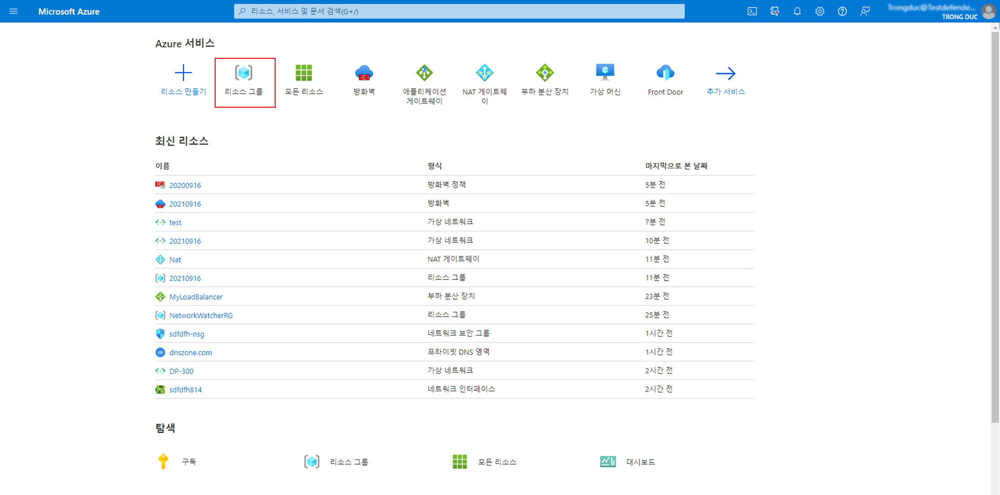
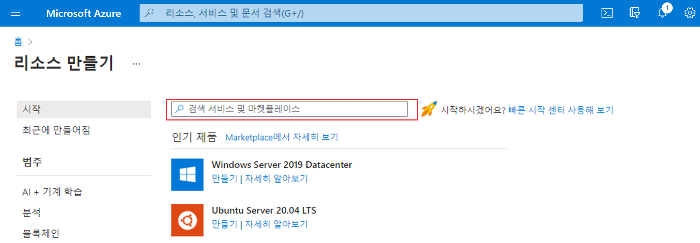
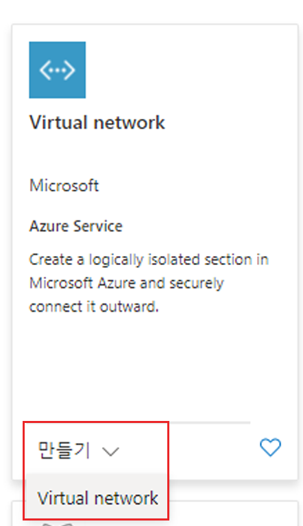
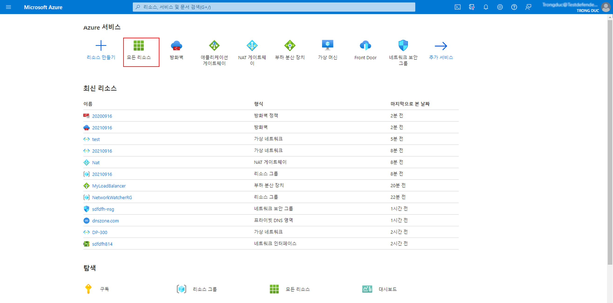
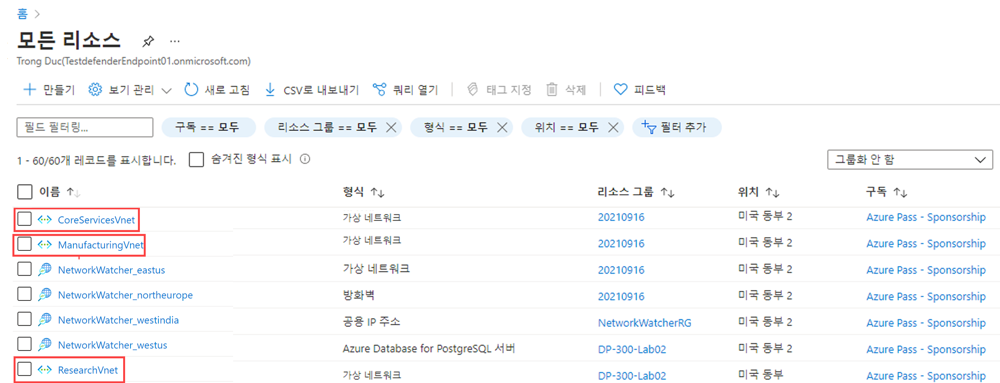
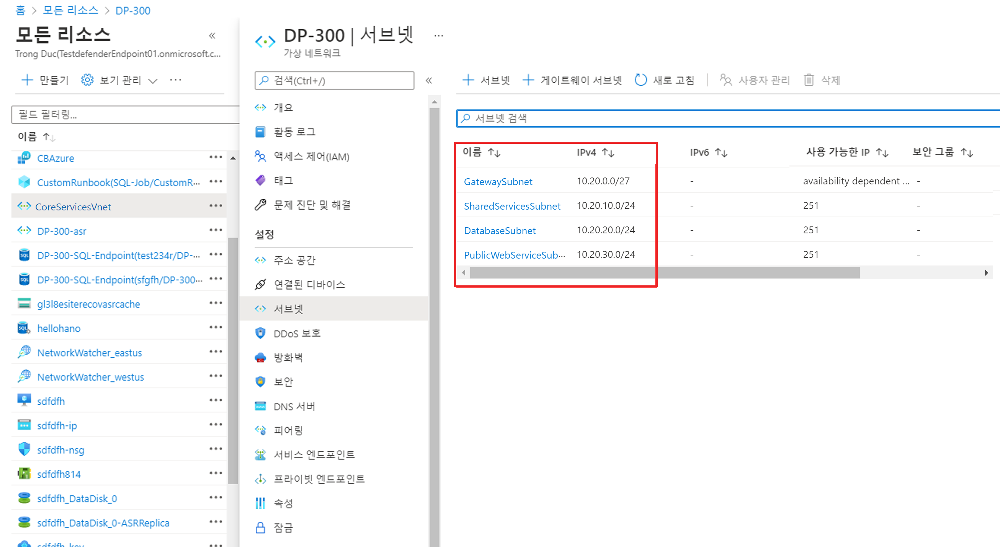

---
Exercise:
    title: 'M01-단원 4 Azure에서 가상 네트워크 설계 및 구현'
    module: '모듈 - Azure Virtual Network 소개'
---
# M01-단원 4 Azure에서 가상 네트워크 설계 및 구현

## 연습 시나리오 

이제 Azure Portal에서 가상 네트워크를 배포할 준비가 되었습니다.

이 연습에서는 가상의 조직인 Contoso Ltd.가 Azure로 인프라와 애플리케이션을 마이그레이션하는 프로세스를 진행 중이라고 가정합니다. 여러분은 Contoso의 네트워크 엔지니어 역할을 맡아 해당 가상 네트워크의 리소스를 지원하기 위해 가상 네트워크와 서브넷 3개를 계획 및 구현해야 합니다.

**CoreServicesVnet** 가상 네트워크는 **미국 서부** 지역에 배포됩니다. 이 가상 네트워크에는 가장 많은 수의 리소스가 포함됩니다. 이 네트워크는 VPN 연결을 통해 온-프레미스 네트워크에 연결됩니다. 이 네트워크에는 웹 서비스, 데이터베이스 및 비즈니스 운영에 중요한 기타 시스템이 포함됩니다. 도메인 컨트롤러 및 DNS와 같은 공유 서비스도 여기에 있습니다. 많은 양의 증가가 예상되므로 이 가상 네트워크에는 대용량 주소 공간이 필요합니다.

**ManufacturingVnet** 가상 네트워크는 조직의 제조 시설 위치와 가까운 **북유럽**지역에 배포됩니다. 이 가상 네트워크에는 제조 시설의 운영을 위한 시스템이 포함됩니다. 조직에서는 시스템의 많은 연결된 내부 디바이스에서 온도와 같은 데이터를 검색할 것으로 예상하므로 확장할 수 있는 IP 주소 공간이 필요합니다.

**ResearchVnet** 가상 네트워크는 조직의 연구/개발 팀 위치와 가까운 **인도 서부** 지역에 배포됩니다. 연구/개발 팀은 이 가상 네트워크를 사용합니다. 이 팀은 확장될 것으로 예상되지 않는 작고 안정적인 리소스 집합을 유지합니다. 또한 소수의 업무용 가상 머신을 위한 소수의 IP 주소가 필요합니다.

다음 리소스를 만듭니다.
 

| **가상 네트워크** | **지역**   | **가상 네트워크 주소 공간** | **서브넷**                | **서브넷**    |
| ------------------- | ------------ | --------------------------------- | ------------------------- | ------------- |
| CoreServicesVnet    | 미국 서부      | 10.20.0.0/16                      |                           |               |
|                     |              |                                   | GatewaySubnet             | 10.20.0.0/27  |
|                     |              |                                   | SharedServicesSubnet      | 10.20.10.0/24 |
|                     |              |                                   | DatabaseSubnet            | 10.20.20.0/24 |
|                     |              |                                   | PublicWebServiceSubnet    | 10.20.30.0/24 |
| ManufacturingVnet   | 북유럽 | 10.30.0.0/16                      |                           |               |
|                     |              |                                   | ManufacturingSystemSubnet | 10.30.10.0/24 |
|                     |              |                                   | SensorSubnet1             | 10.30.20.0/24 |
|                     |              |                                   | SensorSubnet2             | 10.30.21.0/24 |
|                     |              |                                   | SensorSubnet3             | 10.30.22.0/24 |
| ResearchVnet        | 인도 서부   | 10.40.0.0/16                      |                           |               |
|                     |              |                                   | ResearchSystemSubnet      | 10.40.0.0/24  |

이러한 가상 네트워크와 서브넷은 기존 리소스를 수용하면서도 예상된 성장을 허용하는 방식으로 구성됩니다. 이러한 가상 네트워크 및 서브넷을 만들어 네트워킹 인프라의 기반을 구축해 보겠습니다.

이 연습에서는 다음을 수행합니다.

+ 작업 1: Contoso 리소스 그룹 만들기
+ 작업 2: CoreServicesVnet 가상 네트워크 및 서브넷 만들기
+ 작업 3: ManufacturingVnet 가상 네트워크 및 서브넷 만들기
+ 작업 4: ResearchVnet 가상 네트워크 및 서브넷 만들기
+ 작업 5: VNet 및 서브넷 만들기 결과 확인

## 작업 1: Contoso 리소스 그룹 만들기

1. [Azure Portal](https://portal.azure.com/)로 이동합니다.

2. 홈 페이지의 **Azure 서비스**에서 **리소스 그룹**을 선택합니다.  
   ‎

3. 리소스 그룹에서 **+ 만들기**를 선택합니다.

4. 다음 표의 정보를 사용하여 리소스 그룹을 만듭니다.

| **탭**         | **옵션**                                 | **값**            |
| --------------- | ------------------------------------------ | -------------------- |
| 기본 사항          | 리소스 그룹                             | ContosoResourceGroup |
|                 | 지역                                     | (미국) 미국 서부         |
| 태그            | 변경 불필요                        |                      |
| 검토 + 만들기 | 설정을 검토하고 **만들기**를 선택합니다. |                      |

5. 리소스 그룹의 목록에 **ContosoResourceGroup**이 표시되는지 확인합니다.

 

## 작업 2: CoreServicesVnet 가상 네트워크 및 서브넷 만들기

1. Azure Portal 홈 페이지에서 **리소스 만들기**를 선택합니다.
2. **검색 서비스 및 마켓플레이스**에 가상 네트워크를 입력합니다.  
   ‎
3. Marketplace의 가상 네트워크에서 **만들기 &gt; 가상 네트워크**를 선택합니다.  
   ‎
4. 다음 표의 정보를 사용하여 CoreServicesVnet 가상 네트워크를 만듭니다.  
   ‎기본 IP 주소 공간 제거 또는 덮어쓰기

 

| **탭**      | **옵션**         | **값**            |
| ------------ | ------------------ | -------------------- |
| 기본 사항       | 리소스 그룹     | ContosoResourceGroup |
|              | 이름               | CoreServicesVnet     |
|              | 지역             | (미국) 미국 서부         |
| IP 주소 | IPv4 주소 공간 | 10.20.0.0/16         |

 5. 다음 표의 정보를 사용하여 CoreServicesVnet 서브넷을 만듭니다.

 6. 각 서브넷 만들기를 시작하려면 **+ 서브넷 추가**를 선택합니다. 각 서브넷 만들기를 마치려면 **추가**를 선택합니다.

| **서브넷**             | **옵션**           | **값**              |
| ---------------------- | -------------------- | ---------------------- |
| GatewaySubnet          | 서브넷 이름          | GatewaySubnet          |
|                        | 서브넷 주소 범위 | 10.20.0.0/27           |
| SharedServicesSubnet   | 서브넷 이름          | SharedServicesSubnet   |
|                        | 서브넷 주소 범위 | 10.20.10.0/24          |
| DatabaseSubnet         | 서브넷 이름          | DatabaseSubnet         |
|                        | 서브넷 주소 범위 | 10.20.20.0/24          |
| PublicWebServiceSubnet | 서브넷 이름          | PublicWebServiceSubnet |
|                        | 서브넷 주소 범위 | 10.20.30.0/24          |

 7. CoreServicesVnet 및 관련 서브넷 만들기를 마치려면 **검토 + 만들기**를 선택합니다.

 8. 구성이 유효성 검사를 통과했는지 확인하고 **만들기**를 선택합니다.
 
 9. 아래 표의 정보에 따라 각 VNet에 대해 1~8단계를 반복합니다.  

## 작업 3: ManufacturingVnet 가상 네트워크 및 서브넷 만들기

| **탭**      | **옵션**         | **값**             |
| ------------ | ------------------ | --------------------- |
| 기본 사항       | 리소스 그룹     | ContosoResourceGroup  |
|              | 이름               | ManufacturingVnet     |
|              | 지역             | (유럽) 북유럽 |
| IP 주소 | IPv4 주소 공간 | 10.30.0.0/16          |

| **서브넷**                | **옵션**           | **값**                 |
| ------------------------- | -------------------- | ------------------------- |
| ManufacturingSystemSubnet | 서브넷 이름          | ManufacturingSystemSubnet |
|                           | 서브넷 주소 범위 | 10.30.10.0/24             |
| SensorSubnet1             | 서브넷 이름          | SensorSubnet1             |
|                           | 서브넷 주소 범위 | 10.30.20.0/24             |
| SensorSubnet2             | 서브넷 이름          | SensorSubnet2             |
|                           | 서브넷 주소 범위 | 10.30.21.0/24             |
| SensorSubnet3             | 서브넷 이름          | SensorSubnet3             |
|                           | 서브넷 주소 범위 | 10.30.22.0/24             |
 

## 작업 4: ResearchVnet 가상 네트워크 및 서브넷 만들기

| **탭**      | **옵션**         | **값**            |
| ------------ | ------------------ | -------------------- |
| 기본 사항       | 리소스 그룹     | ContosoResourceGroup |
|              | 이름               | ResearchVnet         |
|              | 지역             | 인도 서부           |
| IP 주소 | IPv4 주소 공간 | 10.40.0.0/16         |

| **서브넷**           | **옵션**           | **값**            |
| -------------------- | -------------------- | -------------------- |
| ResearchSystemSubnet | 서브넷 이름          | ResearchSystemSubnet |
|                      | 서브넷 주소 범위 | 10.40.0.0/24         |
 

## 작업 5: VNet 및 서브넷 만들기 결과 확인

1. Azure Portal 홈 페이지에서 **모든 리소스**를 선택합니다.

   

2. CoreServicesVnet, ManufacturingVnet 및 ResearchVnet이 표시되는지 확인합니다. 목록이 다음과 같이 표시되어야 합니다.

   

3. Azure에서는 사용하는 각 지역용으로 NetworkWatcher가 만들어집니다.

4. **CoreServicesVM**을 선택합니다. 

5. CoreServicesVnet의 **설정** 아래에서 **서브넷**을 선택합니다.

6. CoreServicesVnet | 서브넷에서 앞에서 만든 서브넷이 표시되며 IP 주소 범위가 올바른지 확인합니다.

   

7. 각 VNet에 대해 4~6단계를 반복합니다.

축하합니다! 리소스 그룹, VNet 3개 및 각 VNet의 관련 서브넷을 만들었습니다. 
