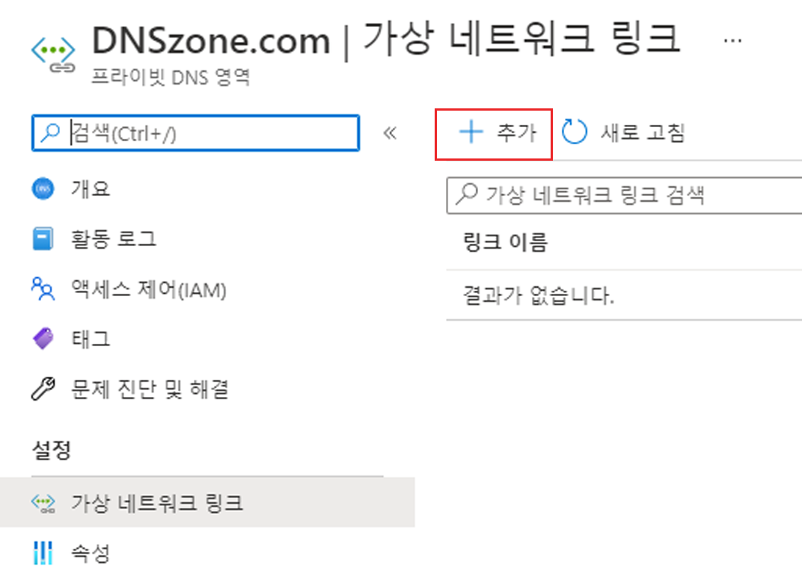
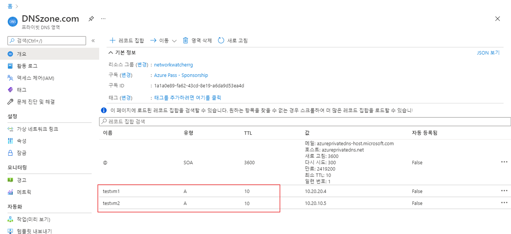

---
Exercise:
    title: 'M01-단원 6 Azure에서 DNS 설정 구성'
    module: '모듈 - Azure Virtual Network 소개'
---

# M01-단원 6 Azure에서 DNS 설정 구성

## 연습 시나리오 
이 단원에서는 Contoso Ltd.용으로 DNS 이름 확인을 구성합니다. 구체적으로는 contoso.com이라는 프라이빗 DNS 영역을 만들고, 등록 및 확인용으로 VNet을 연결한 후 가상 머신 2개를 만들고 구성을 테스트합니다.

이 연습에서는 다음을 수행합니다.

+ 작업 1: 프라이빗 DNS 영역 만들기
+ 작업 2: 자동 등록용으로 서브넷 연결
+ 작업 3: 가상 머신을 만들어 구성 테스트
+ 작업 4: DNS 영역에 레코드가 있는지 확인

## 작업 1: 프라이빗 DNS 영역 만들기

1. [Azure Portal](https://portal.azure.com/)로 이동합니다.

2. Azure 홈 페이지의 검색 창에 DNS를 입력하고 **프라이빗 DNS 영역**을 선택합니다.  
   ‎

3. 프라이빗 DNS 영역에서 **+ 만들기**를 선택합니다.

4. 다음 표의 정보를 사용하여 프라이빗 DNS 영역을 만듭니다.

| **탭**         | **옵션**                             | **값**            |
| --------------- | -------------------------------------- | -------------------- |
| 기본 사항          | 리소스 그룹                         | ContosoResourceGroup |
|                 | 이름                                   | Contoso.com          |
| 태그            | 변경 불필요                    |                      |
| 검토 + 만들기 | 설정을 검토하고 만들기를 선택합니다. |                      |

5. 배포가 완료될 때까지 기다렸다가 **리소스로 이동**을 선택합니다.

6. 영역이 만들어졌는지 확인합니다.

## 작업 2: 자동 등록용으로 서브넷 연결

1. Contoso.com의 **설정** 아래에서 **가상 네트워크 링크**를 선택합니다.

2. Contoso.com | 가상 네트워크 링크에서 **+ 추가**를 선택합니다.

3. 다음 표의 정보를 사용하여 가상 네트워크 링크를 추가합니다.

| **옵션**                          | **값**                               |
| ----------------------------------- | --------------------------------------- |
| 링크 이름                           | CoreServicesVnetLink                    |
| 구독                        | 변경 불필요                     |
| 가상 네트워크                     | CoreServicesVnet(ContosoResourceGroup) |
| 자동 등록 사용            | 선택됨                                |
| 설정을 검토하고 확인을 선택합니다. |                                         |

4. **새로 고침**을 선택합니다.

5. CoreServicesVnetLink가 만들어졌으며 자동 등록이 사용하도록 설정되었는지 확인합니다.

6. 아래 표의 정보를 사용하여 ManufacturingVnet에 대해 2~5단계를 반복합니다. 

| **옵션**                          | **값**                                |
| ----------------------------------- | ---------------------------------------- |
| 링크 이름                           | ManufacturingVnetLink                    |
| 구독                        | 변경 불필요                      |
| 가상 네트워크                     | ManufacturingVnet(ContosoResourceGroup) |
| 자동 등록 사용            | 선택됨                                 |
| 설정을 검토하고 확인을 선택합니다. |                                          |

7. **새로 고침**을 선택합니다.

8. ManufacturingVnetLink가 만들어졌으며 자동 등록이 사용하도록 설정되었는지 확인합니다.

9. 아래 표의 정보를 사용하여 ResearchVnet에 대해 2~5단계를 반복합니다. 

| **옵션**                          | **값**                           |
| ----------------------------------- | ----------------------------------- |
| 링크 이름                           | ResearchVnetLink                    |
| 구독                        | 변경 불필요                 |
| 가상 네트워크                     | ResearchVnet(ContosoResourceGroup) |
| 자동 등록 사용            | 선택됨                            |
| 설정을 검토하고 확인을 선택합니다. |                                     |

10. **새로 고침**을 선택합니다.

11. ResearchVnetLink가 만들어졌으며 자동 등록이 사용하도록 설정되었는지 확인합니다.

 

##  작업 3: 가상 머신을 만들어 구성 테스트

이 섹션에서는 테스트 VM 2개를 만들어 프라이빗 DNS 영역 구성을 테스트합니다.

### TestVM1 만들기

1. Azure 홈 페이지에서 전역 검색을 사용하여 **가상 네트워크**를 입력하고 서비스에서 가상 머신을 선택합니다.

2. 가상 머신에서 **+ 만들기, + 가상 머신**을 선택합니다.

3. 다음 표의 정보를 사용하여 첫 번째 VM을 만듭니다.

| **탭**         | **옵션**                                                   | **값**                             |
| --------------- | ------------------------------------------------------------ | ------------------------------------- |
| 기본 사항          | 리소스 그룹                                               | ContosoResourceGroup                  |
|                 | 가상 머신 이름                                         | TestVM1                               |
|                 | 지역                                                       | 미국 동부                               |
|                 | 가용성 옵션                                         | 인프라 중복 필요 없음 |
|                 | 이미지                                                        | Windows Server 2022 Datacenter - Gen1  |
|                 | Azure Spot 인스턴스                                          | 선택되지 않음                          |
|                 | 크기                                                         | Standard_D2s_v3 - vCPU 2개, 8GiB 메모리 |
|                 | 사용자 이름                                                     | TestUser                              |
|                 | 암호                                                     | TestPa$$w0rd!                         |
|                 | 공용 인바운드 포트                                         | 선택한 포트 허용                  |
|                 | 인바운드 포트 선택                                         | RDP(3389)                            |
| 디스크           | 변경 불필요                                          |                                       |
| 네트워킹      | 가상 네트워크                                              | CoreServicesVnet                      |
|                 | 서브넷                                                       | DatabaseSubnet(10.20.20.0/24)        |
|                 | 공용 IP                                                    | (신규) TestVM1-ip                      |
|                 | NIC 네트워크 보안 그룹                                   | 기본                                 |
|                 | 공용 인바운드 포트                                         | 선택한 포트 허용                  |
|                 | 인바운드 포트 선택                                         | RDP(3389)                            |
|                 | 부하 분산                                               | 선택되지 않음                          |
| 관리      | 변경 불필요                                          |                                       |
| 고급        | 변경 불필요                                          |                                       |
| 태그            | 변경 불필요                                          |                                       |
| 검토 + 만들기 | 설정을 검토하고 만들기를 선택합니다.                       |                                       |

4. 배포가 진행되는 동안 TestVM2 만들기를 진행할 수 있습니다.

### TestVM2 만들기

1. Azure 홈 페이지에서 전역 검색을 사용하여 **가상 네트워크**를 입력하고 서비스에서 가상 머신을 선택합니다.

2. 가상 머신에서 **+ 만들기, + 가상 머신**을 선택합니다.

3. 다음 표의 정보를 사용하여 두 번째 VM을 만듭니다.

| **탭**         | **옵션**                                                   | **값**                             |
| --------------- | ------------------------------------------------------------ | ------------------------------------- |
| 기본 사항          | 리소스 그룹                                               | ContosoResourceGroup                  |
|                 | 가상 머신 이름                                         | TestVM2                               |
|                 | 지역                                                       | 미국 동부                               |
|                 | 가용성 옵션                                         | 인프라 중복 필요 없음 |
|                 | 이미지                                                        | Windows Server 2022 Datacenter - Gen1  |
|                 | Azure Spot 인스턴스                                          | 선택되지 않음                          |
|                 | 크기                                                         | Standard_D2s_v3 - vCPU 2개, 8GiB 메모리 |
|                 | 사용자 이름                                                     | TestUser                              |
|                 | 암호                                                     | TestPa$$w0rd!                         |
|                 | 공용 인바운드 포트                                         | 선택한 포트 허용                  |
|                 | 인바운드 포트 선택                                         | RDP(3389)                            |
| 디스크           | 변경 불필요                                          |                                       |
| 네트워킹      | 가상 네트워크                                              | CoreServicesVnet                      |
|                 | 서브넷                                                       | DatabaseSubnet(10.20.20.0/24)        |
|                 | 공용 IP                                                    | (신규) TestVM2-ip                      |
|                 | NIC 네트워크 보안 그룹                                   | 기본                                 |
|                 | 공용 인바운드 포트                                         | 선택한 포트 허용                  |
|                 | 인바운드 포트 선택                                         | RDP(3389)                            |
|                 | 부하 분산                                               | 선택되지 않음                          |
| 관리      | 변경 불필요                                          |                                       |
| 고급        | 변경 불필요                                          |                                       |
| 태그            | 변경 불필요                                          |                                       |
| 검토 + 만들기 | 설정을 검토하고 **만들기**를 선택합니다.                   |                                       |

4. 배포가 완료되면 Azure Portal 홈 페이지로 이동하여 **가상 머신**을 선택합니다.

5. 두 가상 머신이 모두 만들어졌는지 확인합니다.

 

## 작업 4: DNS 영역에 레코드가 있는지 확인

1. Azure Portal 홈 페이지에서 **프라이빗 DNS 영역**을 선택합니다.

2. 프라이빗 DNS 영역에서 **contoso.com**을 선택합니다.

3. 다음과 같이 두 VM에 모두 호스트 (A) 레코드가 표시되는지 확인합니다.

 

4. VM의 이름과 IP 주소를 적어 둡니다.

 

### RDP를 사용하여 테스트 VM에 연결

1. Azure Portal 홈 페이지에서 **가상 머신**을 선택합니다.

2. **TestVM1**을 선택합니다.

3. TestVM1에서 **연결 &gt; RDP**를 선택합니다.

4. TestVM1 | 연결에서 **RDP 파일 다운로드**를 선택합니다.

5. 바탕 화면에 RDP 파일을 저장합니다.

6. Azure Portal 홈 페이지에서 **가상 머신**을 선택합니다.

7. **TestVM2**을 선택합니다.

8. TestVM2에서 **연결 &gt; RDP**를 선택합니다.

9. TestVM2 | 연결에서 **RDP 파일 다운로드**를 선택합니다.

10. 바탕 화면에 RDP 파일을 저장합니다.

11. RDP 파일, 사용자 이름 **TestUser** 및 암호 **TestPa$w0rd!**를 사용하여 TestVM1에 연결합니다.

12. RDP 파일, 사용자 이름 **TestUser** 및 암호 **TestPa$w0rd!**를 사용하여 TestVM2에 연결합니다.

13. 두 VM의 **디바이스의 개인 정보 설정 선택**에서 **수락**을 선택합니다.

14. 메시지가 표시되면 두 VM의 **네트워크**에서 **예**를 선택합니다.

15. TestVM1에서 명령 프롬프트를 열고 ipconfig /all 명령을 입력합니다.

16. IP 주소가 DNS 영역에서 적어 둔 것과 같은지 확인합니다.

17. ping TestVM2.contoso.com 명령을 입력합니다.

18. TestVM2에서 회신 4개가 수신되는지 확인합니다.

 

축하합니다! 프라이빗 DNS 영역을 만들고 이름 확인 및 자동 등록 링크를 추가했으며, 구성에서 이름 확인을 테스트했습니다. 
