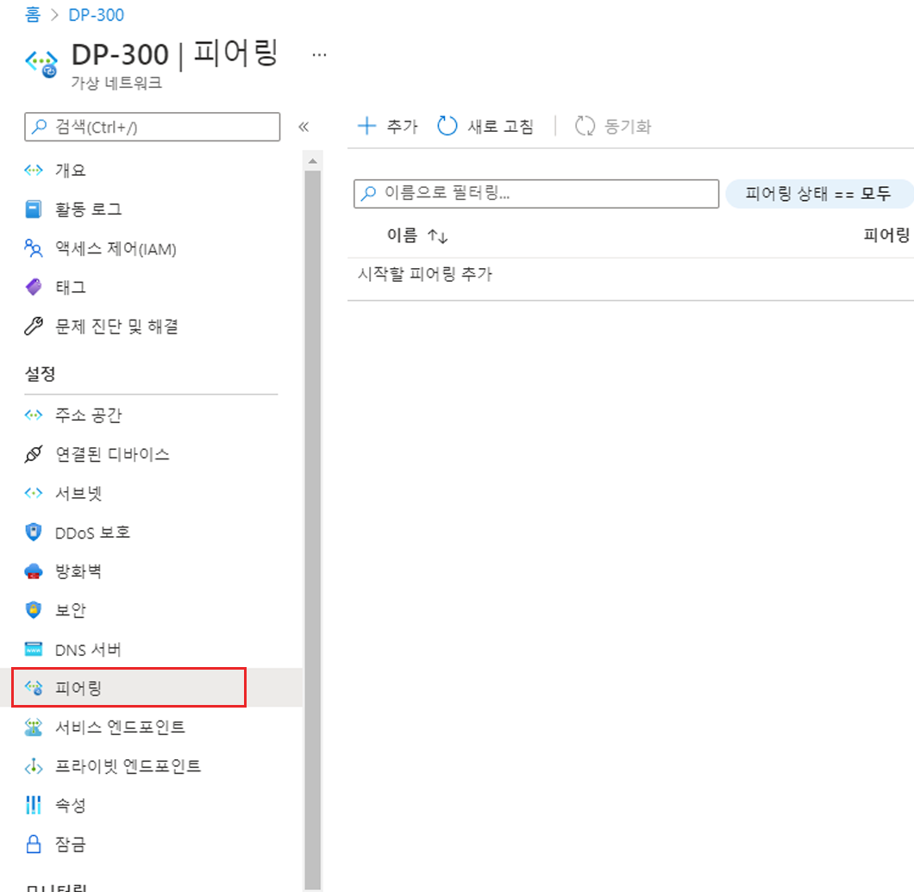

---
Exercise:
    title: 'M01-단원 8 전역 가상 네트워크 피어링을 사용해 Azure Virtual Network 2개 연결'
    module: '모듈 - Azure Virtual Network 소개'
---
# M01-단원 8 전역 가상 네트워크 피어링을 사용해 Azure Virtual Network 2개 연결

## 연습 시나리오 
이 단원에서는 트래픽 흐름을 허용하는 피어링을 추가하여 CoreServicesVnet과 ManufacturingVnet 간의 연결을 구성합니다. 

이 단원에서는 다음을 수행합니다.

+ 작업 1: 가상 머신을 만들어 구성 테스트
+ 작업 2: RDP를 사용하여 테스트 VM에 연결
+ 작업 3: VM 간의 연결 테스트
+ 작업 4: CoreServicesVnet과 ManufacturingVnet 간의 VNet 피어링 만들기
+ 작업 5: VM 간의 연결 테스트
+ 작업 6: 리소스 정리

## 작업 1: 가상 머신을 만들어 구성 테스트

이 섹션에서는 Manufacturing VNet에 테스트 VM을 만들어 ManufacturingVnet에서 다른 Azure Virtual Network 내의 리소스에 액세스할 수 있는지 테스트합니다.

### ManufacturingVM 만들기

1. Azure 홈 페이지에서 전역 검색을 사용하여 **가상 네트워크**를 입력하고 서비스에서 가상 머신을 선택합니다.

2. 가상 머신에서 **+ 만들기, + 가상 머신**을 선택합니다.

3. 다음 표의 정보를 사용하여 VM을 만듭니다.

| **탭**         | **옵션**                                                   | **값**                             |
| --------------- | ------------------------------------------------------------ | ------------------------------------- |
| 기본 사항          | 리소스 그룹                                               | ContosoResourceGroup                  |
|                 | 가상 머신 이름                                         | ManufacturingVM                       |
|                 | 지역                                                       | 서유럽                           |
|                 | 가용성 옵션                                         | 인프라 중복이 필요하지 않습니다. |
|                 | 이미지                                                        | Windows Server 2022 Datacenter - Gen1  |
|                 | Azure Spot 인스턴스                                          | 선택되지 않음                          |
|                 | 크기                                                         | Standard_D2s_v3 - vCPU 2개, 8GiB 메모리 |
|                 | 사용자 이름                                                     | TestUser                              |
|                 | 암호                                                     | TestPa$$w0rd!                         |
|                 | 공용 인바운드 포트                                         | 선택한 포트 허용                  |
|                 | 인바운드 포트 선택                                         | RDP(3389)                            |
| 디스크           | 변경 불필요                                          |                                       |
| 네트워킹      | 가상 네트워크                                              | ManufacturingVnet                     |
|                 | 서브넷                                                       | ManufacturingSystemSubnet(10.30.10.0/24)|
|                 | 공용 IP                                                    | (신규) ManufacturingVM-ip              |
|                 | NIC 네트워크 보안 그룹                                   | 기본                                 |
|                 | 공용 인바운드 포트                                         | 선택한 포트 허용                  |
|                 | 인바운드 포트 선택                                         | RDP(3389)                            |
|                 | 부하 분산                                               | 선택되지 않음                          |
| 관리      | 변경 불필요                                          |                                       |
| 고급        | 변경 불필요                                          |                                       |
| 태그            | 변경 불필요                                          |                                       |
| 검토 + 만들기 | 설정을 검토하고 만들기를 선택합니다.                       |                                       |


4. 배포가 완료되면 **리소스로 이동**을 선택합니다.

## 작업 2: RDP를 사용하여 테스트 VM에 연결

1. Azure Portal 홈 페이지에서 **가상 머신**을 선택합니다.

2. **ManufacturingVM**을 선택합니다.

3. ManufacturingVM에서 **연결 &gt; RDP**를 선택합니다.

4. ManufacturingVM | 연결에서 **RDP 파일 다운로드**를 선택합니다.

5. 바탕 화면에 RDP 파일을 저장합니다.

6. RDP 파일, 사용자 이름 **TestUser** 및 암호 **TestPa$w0rd!**를 사용하여 ManufacturingVM에 연결합니다.

7. Azure Portal 홈 페이지에서 **가상 머신**을 선택합니다.

8. **TestVM1**을 선택합니다.

9. TestVM1에서 **연결 &gt; RDP**를 선택합니다.

10. TestVM1 | 연결에서 **RDP 파일 다운로드**를 선택합니다.

11. 바탕 화면에 RDP 파일을 저장합니다.

12. RDP 파일, 사용자 이름 **TestUser** 및 암호 **TestPa$w0rd!**를 사용하여 TestVM1에 연결합니다.

13. 두 VM의 **디바이스의 개인 정보 설정 선택**에서 **수락**을 선택합니다.

14. 두 VM의 **네트워크**에서 **예**를 선택합니다.

15. TestVM1에서 PowerShell 프롬프트를 열고 ipconfig 명령을 실행합니다.

16. IPv4 주소를 적어 둡니다. 

 

## 작업 3: VM 간의 연결 테스트

1. ManufacturingVM에서 PowerShell 프롬프트를 엽니다.

2. 다음 명령을 사용하여 CoreServicesVnet에서 TestVM1로의 연결이 설정되어 있지 않음을 확인합니다. TestVM1의 IPv4 주소를 사용해야 합니다.

| PowerShell                               |
| ---------------------------------------- |
| Test-NetConnection 10.20.20.4 -port 3389 |


3. 테스트 연결이 실패하고 다음과 같은 결과가 표시됩니다.
   

 

## 작업 4: CoreServicesVnet과 ManufacturingVnet 간의 VNet 피어링 만들기

1. Azure 홈 페이지에서 **가상 네트워크**, **CoreServicesVnet**을 차례로 선택합니다.

2. CoreServicesVnet의 **설정** 아래에서 **피어링**을 선택합니다.
   

3. CoreServicesVnet | 피어링에서 **+ 추가**를 선택합니다.

4. 다음 표의 정보를 사용하여 피어링을 만듭니다.

| **구역**                          | **옵션**                                    | **값**                             |
| ------------------------------------ | --------------------------------------------- | ------------------------------------- |
| 이 가상 네트워크                 |                                               |                                       |
|                                      | 피어링 링크 이름                             | CoreServicesVnet-to-ManufacturingVnet |
|                                      | 원격 가상 네트워크로의 트래픽             | 허용(기본값)                       |
|                                      | 원격 가상 네트워크로부터 전달된 트래픽 | 허용(기본값)                       |
|                                      | 가상 네트워크 게이트웨이 또는 경로 서버       | 없음(기본값)                        |
| 원격 가상 네트워크               |                                               |                                       |
|                                      | 피어링 링크 이름                             | ManufacturingVnet-to-CoreServicesVnet |
|                                      | 가상 네트워크 배포 모델              | Resource Manager                      |
|                                      | 리소스 ID를 알고 있음                         | 선택되지 않음                          |
|                                      | 구독                                  | MOC Subscription-lodxxxxxxxx          |
|                                      | 가상 네트워크                               | ManufacturingVnet                     |
|                                      | 원격 가상 네트워크로의 트래픽             | 허용(기본값)                       |
|                                      | 원격 가상 네트워크로부터 전달된 트래픽 | 허용(기본값)                       |
|                                      | 가상 네트워크 게이트웨이 또는 경로 서버       | 없음(기본값)                        |
| 설정을 검토하고 추가를 선택합니다. |                                               |                                       |
|                                      |                                               |                                       |


5. CoreServicesVnet | 피어링에서 **CoreServicesVnet-to-ManufacturingVnet** 피어링이 표시되는지 확인합니다.

6. 가상 네트워크 아래에서 **ManufacturingVnet**을 선택하고 **ManufacturingVnet-to-CoreServicesVnet** 피어링이 표시되는지 확인합니다.

 

## 작업 5: VM 간의 연결 테스트

1. ManufacturingVM에서 PowerShell 프롬프트를 엽니다.

2. 다음 명령을 사용하여 이제 CoreServicesVnet에서 TestVM1로의 연결이 설정되어 있음을 확인합니다. 

| PowerShell                               |
| ---------------------------------------- |
| Test-NetConnection 10.20.20.4 -port 3389 |


3. 테스트 연결이 성공하고 다음과 같은 결과가 표시됩니다.
   

 

축하합니다! 피어링을 추가하여 VNet 간의 연결을 구성했습니다. 

## 작업 6: 리소스 정리

   >**참고**: 더 이상 사용하지 않는 새로 만든 Azure 리소스를 제거해야 합니다. 사용하지 않는 리소스를 제거하면 예기치 않은 비용이 발생하지 않습니다.

1. Azure Portal에서 **Cloud Shell** 창의 **PowerShell** 세션을 엽니다. (필요한 경우 기본 설정을 사용하여 Cloud Shell 스토리지 만들기)

1. 다음 명령을 실행하여 이 모듈의 전체 랩에서 만든 모든 리소스 그룹을 삭제합니다.

   ```powershell
   Remove-AzResourceGroup -Name 'ContosoResourceGroup' -Force -AsJob
   ```

    >**참고**: 명령은 비동기적으로 실행되므로(-AsJob 매개 변수에 의해 결정됨) 동일한 PowerShell 세션 내에서 즉시 다른 PowerShell 명령을 실행할 수 있지만 리소스 그룹이 실제로 제거되기까지 몇 분 정도 걸릴 것입니다.
