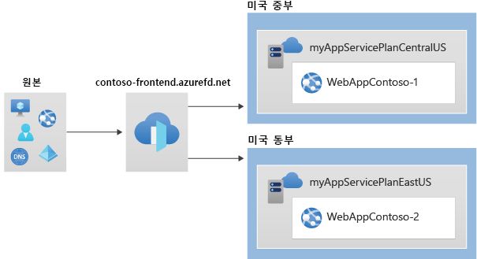
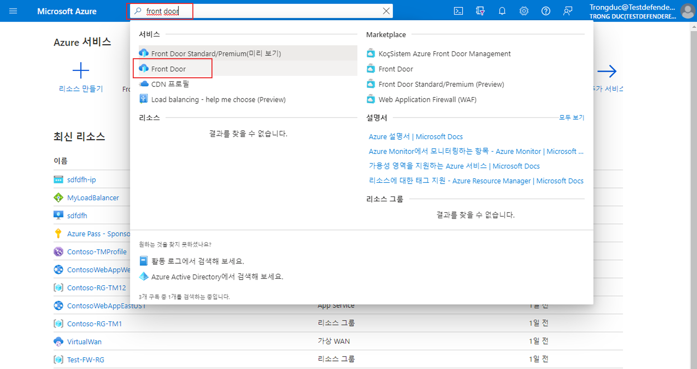
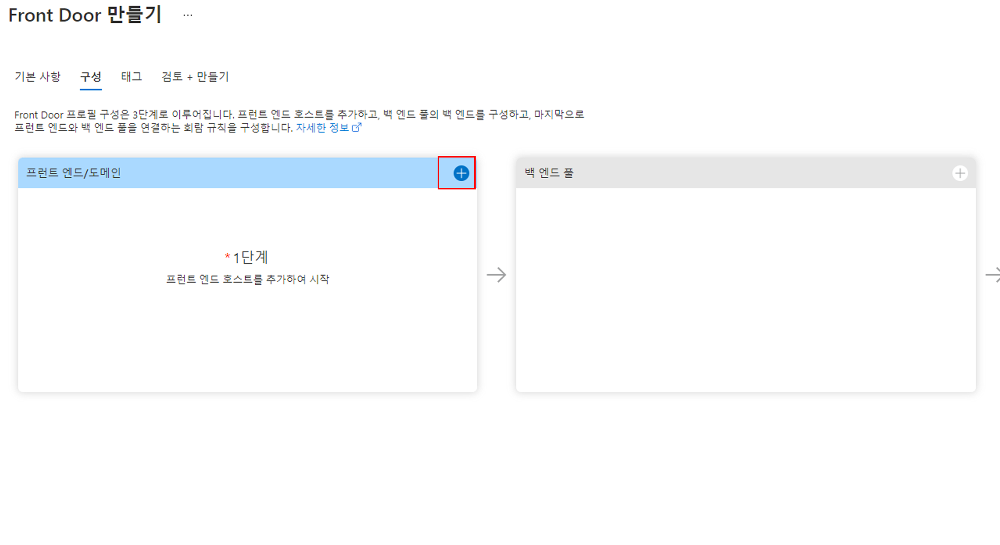
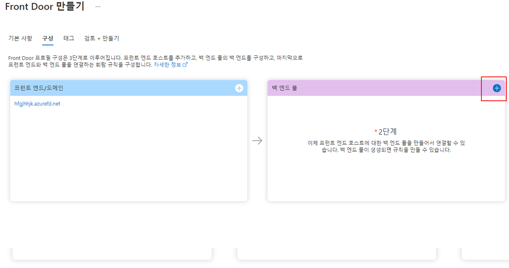
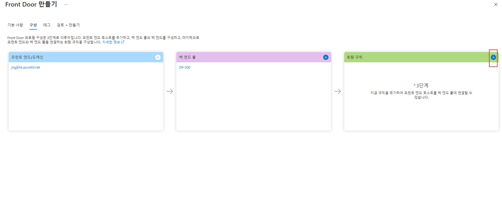
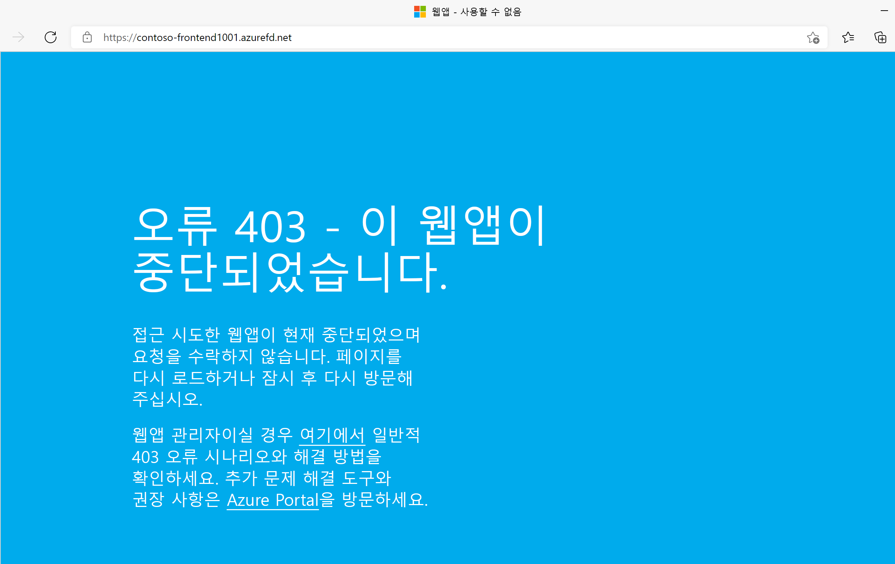

---
Exercise:
    title: 'M05-단원 6 Azure Portal을 사용하여 고가용성 웹 애플리케이션용 Front Door 만들기'
    module: '모듈 - Azure에서 HTTP(S) 트래픽 부하 분산'
---


# M05-단원 6 Azure Portal을 사용하여 고가용성 웹 애플리케이션용 Front Door 만들기

 

이 연습에서는 서로 다른 Azure 지역에서 실행되는 웹 애플리케이션의 인스턴스 2개를 풀링하는 Azure Front Door 구성을 설정합니다. 이 구성은 애플리케이션을 실행하는 가장 가까운 사이트로 트래픽을 보냅니다. Azure Front Door는 웹 애플리케이션을 지속적으로 모니터링합니다. 이 연습에서는 가장 가까운 사이트를 사용할 수 없을 때 진행되는 사용 가능한 다음 사이트로의 자동 장애 조치(failover)를 시연합니다. 네트워크 구성은 다음 다이어그램에 나와 있습니다.



이 연습에서는 다음을 수행합니다.

+ 작업 1: 웹앱의 두 인스턴스 만들기
+ 작업 2: 애플리케이션용 Front Door 만들기
+ 작업 3: 작동 중인 Azure Front Door 보기
+ 작업 4: 리소스 정리


## 작업 1: 웹앱의 두 인스턴스 만들기

이 연습에는 서로 다른 Azure 지역에서 실행되는 웹 애플리케이션의 두 인스턴스가 필요합니다. 두 웹 애플리케이션 인스턴스는 모두 활성/활성 모드로 실행되므로 두 인스턴스 중 하나에서 트래픽을 수행할 수 있습니다. 이 구성은 장애 조치(failover)로 작동하는 활성/대기 구성과 다릅니다.

1. [https://portal.azure.com](https://portal.azure.com/)에서 Azure Portal에 로그인합니다.

2. Azure Portal 홈 페이지에서 + **리소스 만들기**를 선택합니다.

3. 리소스 만들기 페이지에서 **웹앱**을 선택합니다.
   

4. 웹앱 만들기 페이지의 기본 사항 탭에서 다음 정보를 입력하거나 선택합니다.

   | **설정**      | **값**                                                    |
   | ---------------- | ------------------------------------------------------------ |
   | 구독     | 구독을 선택합니다.                                    |
   | 리소스 그룹   | 리소스 그룹 ContosoResourceGroup을 선택합니다.               |
   | 이름             | 웹앱의 고유한 이름을 입력합니다. 이 예제에서는 WebAppContoso-1을 사용합니다. |
   | 게시          | **코드**를 선택합니다.                                             |
   | 런타임 스택    | **NET Core 2.1(LTS)**을 선택합니다.                              |
   | 운영 체제 | **Windows**를 선택합니다.                                          |
   | 지역           | **미국 중부**를 선택합니다.                                       |
   | Windows 플랜     | **새로 만들기**를 선택하고 텍스트 상자에 myAppServicePlanCentralUS를 입력합니다. |
   | SKU 및 크기     | **Standard S1 총 ACU 100개, 1.75GB 메모리**를 선택합니다.        |

5. **검토 + 만들기**를 선택하고 요약을 검토한 다음 **만들기**를 선택합니다.   
   ‎배포가 완료되는 데 몇 분 정도 걸릴 수 있습니다.

6. 두 번째 웹앱을 만듭니다. Azure Portal 홈 페이지에서 + **리소스 만들기**를 선택합니다.

7. 리소스 만들기 페이지에서 **웹앱**을 선택합니다.

8. 웹앱 만들기 페이지의 기본 사항 탭에서 다음 정보를 입력하거나 선택합니다.

   | **설정**      | **값**                                                    |
   | ---------------- | ------------------------------------------------------------ |
   | 구독     | 구독을 선택합니다.                                    |
   | 리소스 그룹   | 리소스 그룹 ContosoResourceGroup을 선택합니다.               |
   | 이름             | 웹앱의 고유한 이름을 입력합니다. 이 예제에서는 WebAppContoso-2을 사용합니다. |
   | 게시          | **코드**를 선택합니다.                                             |
   | 런타임 스택    | **NET Core 2.1(LTS)**을 선택합니다.                              |
   | 운영 체제 | **Windows**를 선택합니다.                                          |
   | 지역           | **미국 동부**를 입력합니다.                                          |
   | Windows 플랜     | **새로 만들기**를 선택하고 텍스트 상자에 myAppServicePlanEastUS를 입력합니다. |
   | SKU 및 크기     | **Standard S1 총 ACU 100개, 1.75GB 메모리**를 선택합니다.        |

9. **검토 + 만들기**를 선택하고 요약을 검토한 다음 **만들기**를 선택합니다.   
   ‎배포가 완료되는 데 몇 분 정도 걸릴 수 있습니다.

## 작업 2: 애플리케이션용 Front Door 만들기

두 웹앱 서버 간의 가장 짧은 대기 시간을 기준으로 사용자 트래픽을 보내도록 Azure Front Door를 구성합니다. 시작하려면 Azure Front Door에 대한 프런트 엔드 호스트를 추가합니다.

1. 아무 Azure Portal 페이지에서나 **리소스, 서비스 및 문서 검색(G+/)**에 front door를 입력하고 결과에서 **Front Door**를 선택합니다.

   

2. Front Door 페이지에서 **+ 만들기**를 선택합니다.

3. Front Door 만들기에서 다음 정보를 입력하거나 선택합니다.

   | **설정**             | **값**                                    |
   | ----------------------- | -------------------------------------------- |
   | 구독            | 구독을 선택합니다.                    |
   | 리소스 그룹          | ContosoResourceGroup을 선택합니다.                  |
   | 리소스 그룹 위치 | **미국 중부**를 선택합니다.                       |

4. **다음: 구성**을 선택합니다.

5. 구성 탭의 **프런트 엔드/도메인**에서 **+**를 선택하여 프런트 엔드 호스트를 추가합니다.

   

6. contoso-frontend와 같이 전역에서 고유한 **호스트 이름**을 입력하고 **추가**를 선택합니다.

7. 다음으로, 2개의 웹앱이 포함된 백 엔드 풀을 만듭니다.  
   ‎Front Door 만들기의 **백 엔드** 풀에서 +를 선택하여 백 엔드 풀을 추가합니다.

   

8. BackendPool과 같이 전역에서 고유한 **호스트 이름**을 입력합니다.

9. **백 엔드** 아래에서 + **백 엔드 추가**를 선택합니다.

10. 백 엔드 추가에서 다음 정보를 입력하거나 선택합니다.

    | **설정**       | **값**                                                    |
    | ------------------ | ------------------------------------------------------------ |
    | 백 엔드 호스트 유형 | **App Service**를 선택합니다.                                      |
    | 구독      | 구독을 선택합니다.                                    |
    | 백 엔드 호스트 이름 | 만든 첫 번째 웹앱을 선택합니다. 이 예제에서 첫 번째 웹앱은 **WebAppContoso-1**입니다. |

11. 나머지 필드는 모두 기본값으로 유지하고 **추가**를 선택합니다.

12. **+ 백 엔드 추가**를 다시 선택하고 다음 정보를 입력하거나 선택합니다.

    | **설정**       | **값**                                                    |
    | ------------------ | ------------------------------------------------------------ |
    | 백 엔드 호스트 유형 | App Service를 선택합니다.                                          |
    | 구독      | 구독을 선택합니다.                                    |
    | 백 엔드 호스트 이름 | 만든 두 번째 웹앱을 선택합니다. 이 예제에서 첫 번째 웹앱은 **WebAppContoso-2**입니다. |

13. 나머지 필드는 모두 기본값으로 유지하고 **추가**를 선택합니다.

14. **백 엔드 풀** **추가** 블레이드에서 **추가**를 선택하여 백 엔드 풀의 구성을 완료합니다.

15. 마지막으로, 회람 규칙을 추가합니다. 회람 규칙은 프런트 엔드 호스트를 백 엔드 풀에 매핑합니다. 이 규칙은 contoso-frontend.azurefd.net에 대한 요청을 myBackendPool에 전달합니다.

16. Front Door 만들기의 **회람 규칙**에서 **+**를 선택하여 회람 규칙을 구성합니다.

    

17. 규칙 추가에서 **이름**에 LocationRule을 입력합니다. 

18. 그 외의 모든 항목에서는 기본값을 적용하고 **추가**를 선택하여 회람 규칙을 추가합니다.

19. **검토 + 만들기**와 **만들기**를 차례로 선택합니다.

**기본 경로(\*)가 연결된 회람 규칙이 Front Door의 각 프런트 엔드 호스트에 있어야 합니다. 즉, 모든 회람 규칙에서 하나 이상의 회람 규칙이 기본 경로(\*)에 정의된 각 프런트 엔드 호스트에 있어야 합니다. 이렇게 하지 않으면 최종 사용자 트래픽이 올바르게 라우팅되지 않을 수 있습니다**.

 

## 작업 3: 작동 중인 Azure Front Door 보기

Front Door를 만들면 구성이 전역적으로 배포되는 데 몇 분 정도 걸립니다. 완료되면 생성한 프런트 엔드 호스트에 액세스합니다. 

1. Azure Portal에서 Front Door 프런트 엔드로 이동합니다. **리소스로 이동**을 선택합니다. 또는 리소스, 서비스 및 문서 검색(G+/)에 **front door**를 입력하고 결과에서 **Front Door**를 선택한 다음 앞에서 만든 Front Door를 선택합니다.

2. Front Door 페이지에서 **프런트 엔드 호스트** URL을 적어 둡니다. 이 연습에서는 contoso-frontend.azurefd.net을 사용합니다. 하지만 고유한 이름 생성을 위해 이 URL을 변경했을 수도 있으므로 정확한 URL을 확인해야 합니다.

   

3. 브라우저에서 프런트 엔드 호스트 URL(contoso-frontend.azurefd.net)로 이동합니다. 요청이 백 엔드 풀에 지정된 서버에서 가장 가까운 서버로 자동 라우팅됩니다.

4. 그러면 다음 정보 페이지가 표시됩니다.

   

5. 즉각적인 글로벌 장애 조치가 작동 중인지 테스트하려면 다음 단계를 수행합니다.

6. Azure Portal로 전환한 다음 **App services**를 검색하여 선택합니다. 

7. 웹앱 중 하나를 선택하고 **중지**를 선택한 후에 **예**를 선택하여 웹앱 중지를 확인합니다.

   

8. 브라우저로 다시 전환하여 새로 고침을 선택합니다. 동일한 정보 페이지가 표시됩니다.

**웹앱 중지가 지연될 수도 있습니다. 브라우저에 오류 페이지가 표시되면 페이지를 새로 고치세요**.

1. Azure Portal로 다시 전환한 후 다른 웹앱을 찾아서 중지합니다.

2. 브라우저로 다시 전환하여 새로 고침을 선택합니다. 이번에는 오류 메시지가 표시됩니다.

   

   축하합니다! Azure Front Door를 구성하고 테스트했습니다.
   
  
   
   ## 작업 4: 리소스 정리
   
   >**참고**: 더 이상 사용하지 않는 새로 만든 Azure 리소스를 제거해야 합니다. 사용하지 않는 리소스를 제거하면 예기치 않은 비용이 발생하지 않습니다.

1. Azure Portal에서 **Cloud Shell** 창 내의 **PowerShell** 세션을 엽니다.

1. 다음 명령을 실행하여 이 모듈의 전체 랩에서 만든 모든 리소스 그룹을 삭제합니다.

   ```powershell
   Remove-AzResourceGroup -Name 'NAME OF THE RG' -Force -AsJob
   ```

    >**참고**: 명령은 비동기적으로 실행되므로(-AsJob 매개 변수에 의해 결정됨) 동일한 PowerShell 세션 내에서 즉시 다른 PowerShell 명령을 실행할 수 있지만 리소스 그룹이 실제로 제거되기까지 몇 분 정도 걸릴 것입니다.
