---
Exercise:
    title: 'M06-단원 4 Azure Portal을 사용하여 가상 네트워크에서 DDoS 보호 구성'
    module: '모듈 - 네트워크 보안 설계 및 구현'
---

# M06-단원 4 Azure Portal을 사용하여 가상 네트워크에서 DDoS 보호 구성

이 연습에서 여러분은 Contoso 네트워크 보안 팀 책임자 역할을 맡아 가상 네트워크에서 모의 DDoS 공격을 실행합니다. 아래 단계에서는 가상 네트워크 구성, DDoS 보호 구성, 공격 만들기 과정을 안내합니다. 원격 분석과 메트릭을 통해 이러한 공격을 관찰하고 모니터링할 수 있습니다.

이 연습에서는 다음을 수행합니다.

+ 작업 1: 리소스 그룹 만들기
+ 작업 2: DDoS 보호 계획 만들기
+ 작업 3: 새 가상 네트워크에서 DDoS 보호를 사용하도록 설정
+ 작업 4: DDoS 원격 분석 구성
+ 작업 5: DDoS 진단 로그 구성
+ 작업 6: DDoS 경고 구성
+ 작업 7: DDoS 서비스 요청을 제출하여 DDoS 공격 실행

## 작업 1: 리소스 그룹 만들기

1. Azure 계정에 로그인

2. Azure Portal 홈 페이지에서 **리소스 그룹**을 선택합니다.

3. **만들기**를 클릭합니다. 

4. **기본 사항** 탭의 **리소스 그룹**에 **MyResourceGroup**을 입력합니다.

5. **지역**의 목록에서 사용자의 지역을 선택합니다.

6. **검토 + 만들기**를 클릭합니다.

   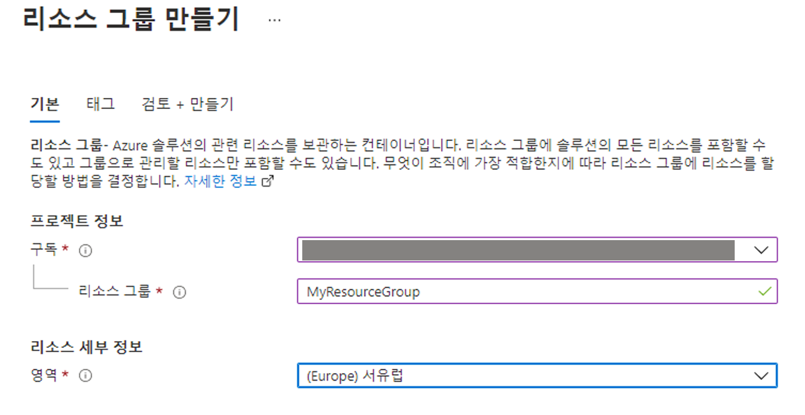

7. **만들기**를 클릭합니다.

   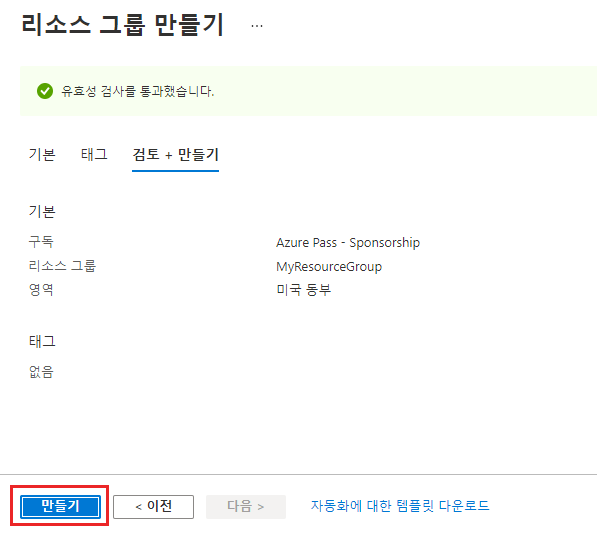

 

## 작업 2: DDoS 보호 계획 만들기

1. Azure Portal 홈 페이지에서 **리소스 만들기**를 선택하고 검색 상자에 **DDoS**를 입력한 후 **DDoS 보호 계획**이 표시되면 클릭합니다.

   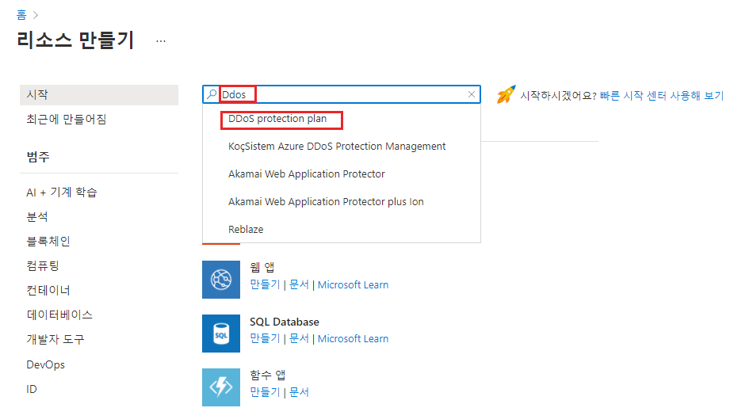

2. **만들기**를 클릭합니다.

3. **기본 사항** 탭의 **리소스 그룹** 목록에서 방금 만든 리소스 그룹을 선택합니다.

4. **인스턴스 이름** 상자에 **MyDdoSProtectionPlan**을 입력하고 **검토 + 만들기**를 클릭합니다.

   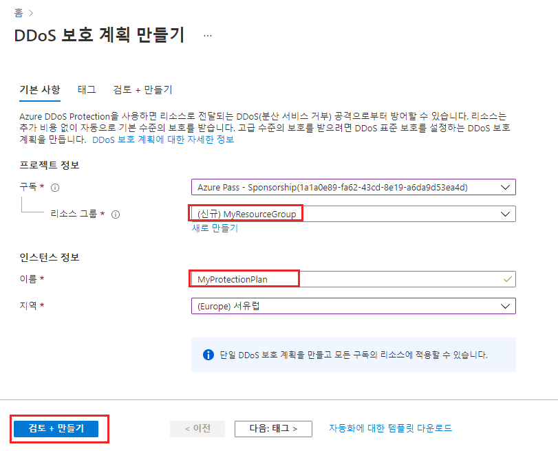

5. **만들기**를 클릭합니다.

 

## 작업 3: 새 가상 네트워크에서 DDoS 보호를 사용하도록 설정

이 작업에서는 기존 가상 네트워크가 아닌 새 가상 네트워크에서 DDoS를 사용하도록 설정합니다. 그러므로 먼저 새 가상 네트워크를 만든 다음, 앞에서 만든 계획을 사용하여 해당 가상 네트워크에서 DDoS 보호를 사용하도록 설정해야 합니다.

1. Azure Portal 홈 페이지에서 **리소스 만들기**를 선택하고 검색 상자에 **가상 네트워크**를 입력한 후 **가상 네트워크**가 표시되면 클릭합니다.

   

2. **가상 네트워크** 페이지에서 **만들기**를 클릭합니다.

3. 앞에서 만든 리소스 그룹을 **기본 사항** 탭에서 선택합니다.

4. **이름** 상자에 **MyVirtualNetwork**를 입력하고 **보안** 탭을 클릭합니다. 

   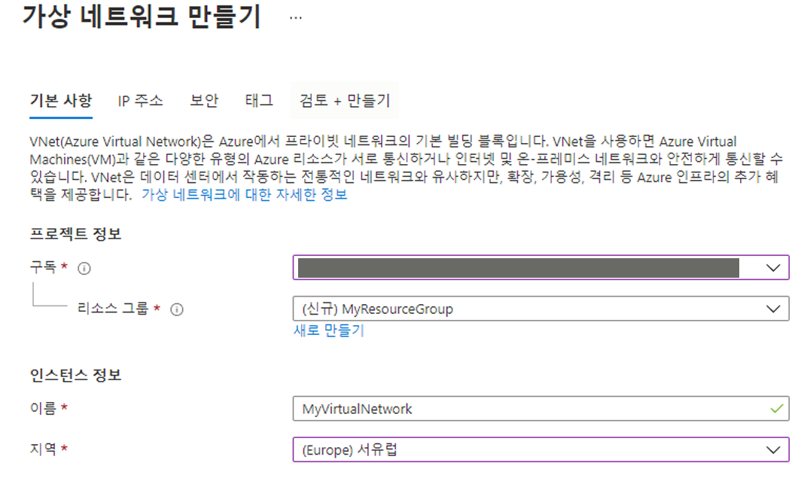

5. **보안** 탭의 **DDoS 보호 표준** 옆에 있는 **사용**을 선택합니다.

6. **DDoS 보호 계획** 드롭다운 목록에서 **MyDdosProtectionPlan**을 선택합니다.

   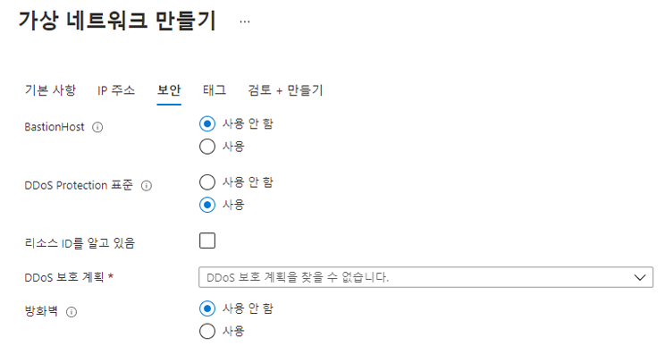

7. **검토 + 만들기**를 클릭합니다.

8. **만들기**를 클릭합니다.

 

## 작업 4: DDoS 원격 분석 구성

다음 단계에서는 공용 IP 주소를 만든 후 원격 분석을 설정합니다.

1. Azure Portal 홈 페이지에서 **리소스 만들기**를 선택하고 검색 상자에 **공용 IP**를 입력한 후 **공용 IP 주소**가 표시되면 클릭합니다.

2. **공용 IP 주소** 페이지에서 **만들기**를 클릭합니다.

3. **공용 IP 주소 만들기** 페이지의 **SKU** 아래에서 **기본**을 클릭합니다.

4. **이름** 상자에 **MyPublicIPAddress**를 입력합니다.

5. **IP 주소 할당**에서 **정적**을 선택합니다.

6. **DNS 이름 레이블**에 **mypublicdns**를 입력합니다.

7. 목록에서 리소스 그룹을 선택합니다.

   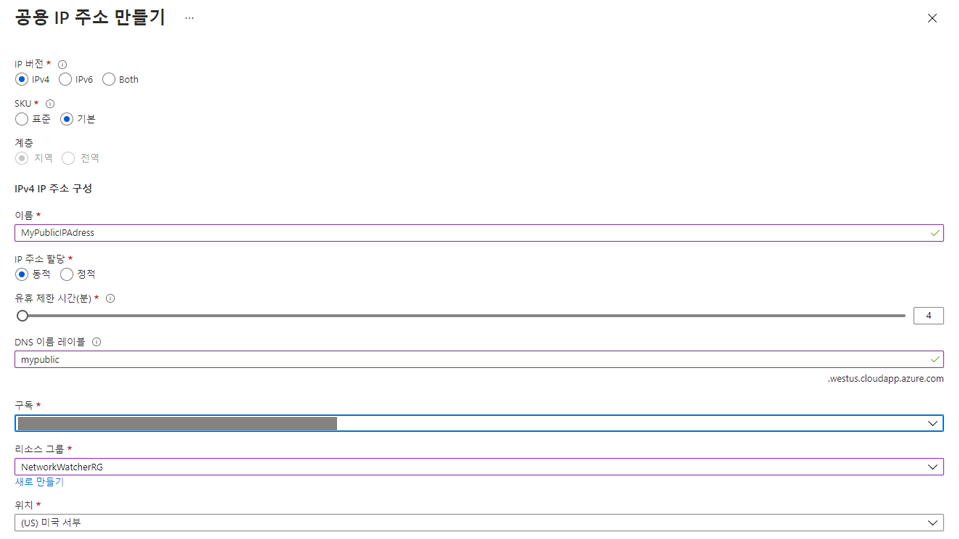

8. **만들기**를 클릭합니다.

9. Azure 홈 페이지에서 **모든 리소스**를 클릭합니다.

10. 리소스 목록에서 **MyDdosProtectionPlan**을 클릭합니다.

11. **모니터링** 아래에서 **메트릭**을 선택합니다.

12. **범위** 상자를 선택하고 **MyPublicIPAddress** 옆의 체크박스를 선택합니다.

    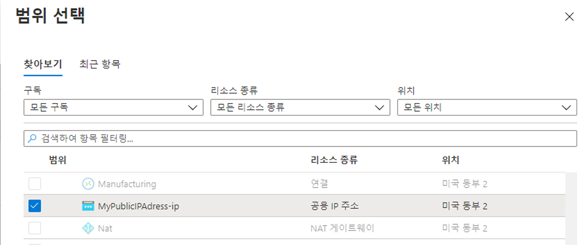

13. **적용**을 클릭합니다.

14. **메트릭** 상자에서 **Inbound packets dropped DDoS**를 선택합니다.

15. **집계** 상자에서 **최대값**을 선택합니다.

    

 

## 작업 5: DDoS 진단 로그 구성

1. Azure 홈 페이지에서 **모든 리소스**를 클릭합니다.

2. 리소스 목록에서 **MyPublicIPAddress**를 클릭합니다.

3. **모니터링** 아래에서 **진단 설정**을 선택합니다.

4. **진단 설정 추가**를 클릭합니다. 

5. **진단 설정** 페이지의 **진단 설정 이름** 상자에 **MyDiagnosticSetting**을 입력합니다. 

6. **범주 세부 정보** 아래에서 **로그** 체크박스 3개와 **AllMetrics** 체크박스를 선택합니다.

7. **대상 세부 정보** 아래에서 **Log Analytics 작업 영역으로 전송** 체크박스를 선택합니다. 여기서 기존 Log Analytics 작업 영역을 선택할 수도 있습니다. 그러나 진단 로그용 대상을 아직 설정하지 않았으므로 설정을 입력만 하고 이 연습의 다음 단계에서 해당 설정을 삭제하겠습니다.

   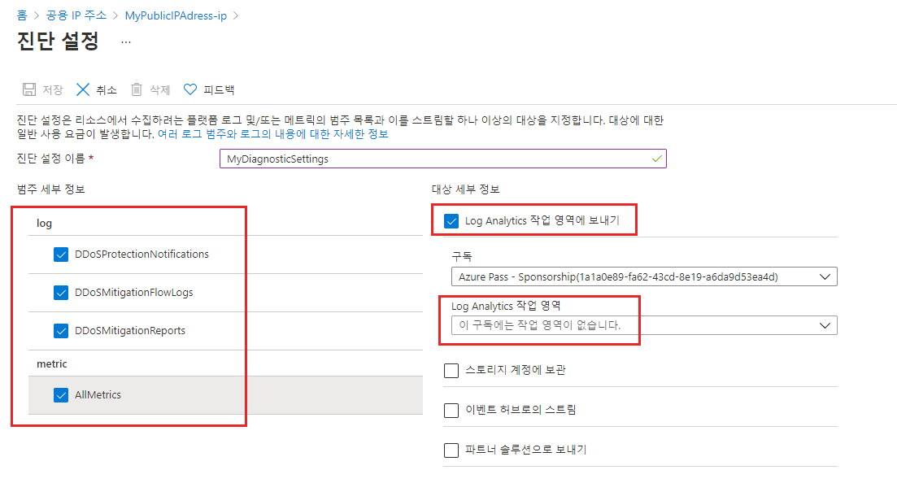

8. 일반적으로는 이제 **저장**을 클릭하여 진단 설정을 저장합니다. 하지만 여기서는 설정 구성을 아직 완료할 수 없으므로 이 옵션이 계속 회색으로 표시됩니다.

9. **삭제**, **예**를 차례로 클릭합니다.

 

## 작업 6: DDoS 경고 구성

이 단계에서는 가상 머신을 만들고 공용 IP 주소를 할당한 다음 DDoS 경고를 구성합니다.

### VM 만들기

1. Azure Portal 홈 페이지에서 **리소스 만들기**를 선택하고 검색 상자에 **가상 머신**을 입력한 후 **가상 머신**이 표시되면 클릭합니다.

2. **가상 머신** 페이지에서 **만들기**를 클릭합니다.

3. **기본 사항** 탭에서 다음 표의 정보를 사용하여 새 VM을 만듭니다.

   | **설정**           | **값**                                                    |
   | --------------------- | ------------------------------------------------------------ |
   | 구독          | 보유한 구독 선택                                     |
   | 리소스 그룹        | **MyResourceGroup**                                          |
   | 가상 머신 이름  | **MyVirtualMachine**                                         |
   | 지역                | 사용자의 지역                                                  |
   | 가용성 옵션  | **인프라 중복이 필요하지 않습니다.**                   |
   | 이미지                 | **Ubuntu Server 18.04 LTS - Gen 1**                         |
   | 크기                  | **모든 크기 보기**를 선택하고 목록에서 **B1ls**를 선택한 다음 **선택** **(Standard_B1ls - vCPU 1개, 0.5GiB 메모리(£3.21/월)**를 선택합니다. |
   | 인증 유형   | **SSH 공개 키**                                           |
   | 사용자 이름              | **azureuser**                                                |
   | SSH 공개 키 원본 | **새 키 쌍 생성**                                    |
   | 키 쌍 이름         | **myvirtualmachine-ssh-key**                                 |

4. **검토 + 만들기**를 클릭합니다.

5. **만들기**를 클릭합니다.

   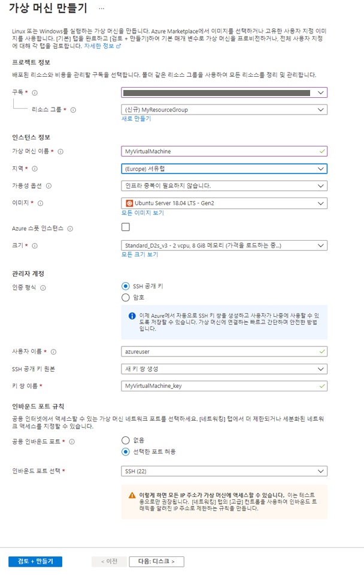

6. **새 키 쌍 생성** 대화 상자에서 **프라이빗 키 다운로드 및 리소스 만들기**를 클릭합니다.

7. 프라이빗 키를 저장합니다.

8. 배포가 완료되면 **리소스로 이동**을 클릭합니다.

### 공용 IP 주소 할당

1. 새 가상 머신의 **개요** 페이지 **설정** 아래에서 **네트워킹**을 클릭합니다.

2. **네트워크 인터페이스** 옆의 **myvirtualmachine**xxx(예: myvirtualmachine892)를 클릭합니다.

3. **설정** 아래에서 **IP 구성**을 클릭합니다.

4. **ipconfig1**을 선택합니다.

5. **공용 IP 주소** 목록에서 **MyPublicIPAddress**를 선택합니다.

6. **저장**을 클릭합니다.

   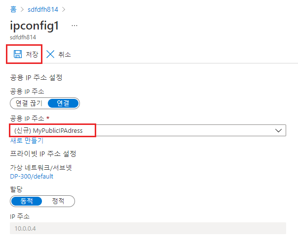

### DDoS 경고 구성

1. Azure 홈 페이지에서 **모든 리소스**를 클릭합니다.

2. 리소스 목록에서 **MyDdosProtectionPlan**을 클릭합니다.

3. **모니터링** 아래에서 **경고**를 선택합니다.

4. **새 경고 규칙**을 클릭합니다.

5. **경고 규칙 만들기** 페이지의 **범위** 아래에서 **리소스 편집**을 클릭합니다.

6. **리소스 선택** 창의 **리소스 종류별로 필터링** 상자에서 목록 아래쪽으로 스크롤하여 **공용 IP 주소**를 선택합니다.

   

7. **리소스** 목록에서 **MyPublicIPAddress**를 선택하고 **완료**를 클릭합니다.

8. **경고 규칙 만들기** 페이지의 **조건** 아래에서 **조건 추가**를 클릭합니다.

9. **DDoS 공격 여부**를 선택합니다.

   

10. **연산자** 상자에서 **보다 크거나 같음**을 선택합니다.

11. **임계값**에 **1**(공격 중)을 입력합니다.

12. **완료**를 클릭합니다.

    

13. **경고 규칙 만들기** 페이지로 돌아와 **경고 규칙 세부 정보** 섹션 아래쪽으로 스크롤한 다음 **경고 규칙 이름**에 **MyDdosAlert**를 입력합니다.

    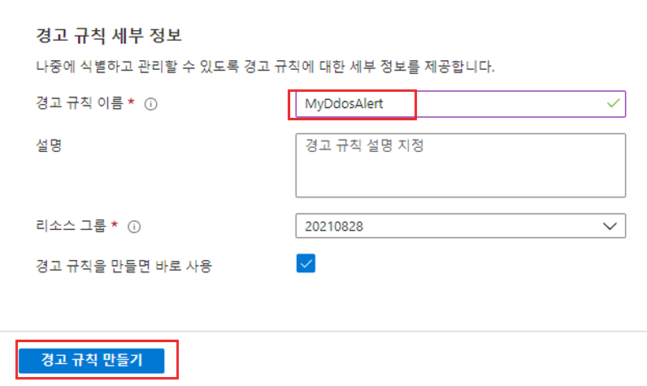

14. **경고 규칙 만들기**를 클릭합니다.

 

## 작업 7: DDoS 서비스 요청을 제출하여 DDoS 공격 실행

1. [BreakingPoint Cloud](https://breakingpoint.cloud/)에서 계정을 만듭니다.

2. 아래 스크린샷의 설정에 따라 DDoS 테스트를 설정합니다. 이때 **대상 IP 주소** 상자에는 사용자의 **MyPublicIPAddress** 리소스의 IP 주소(예: **51.140.137.219**)를 지정합니다.

   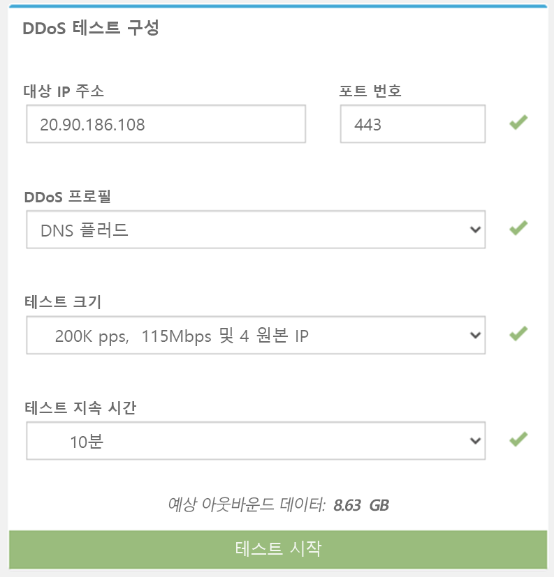

3. Azure Portal 홈 페이지에서 **모든 리소스**를 클릭합니다.

4. 리소스 목록에서 **MyPublicIPAddress** 리소스를 클릭하고 **모니터링** 아래에서 **메트릭**을 클릭합니다. 

5. **메트릭** 상자의 목록에서 **DDoS 공격 여부**를 선택합니다.

6. 그러면 발생한 DDoS 공격을 확인할 수 있습니다.

   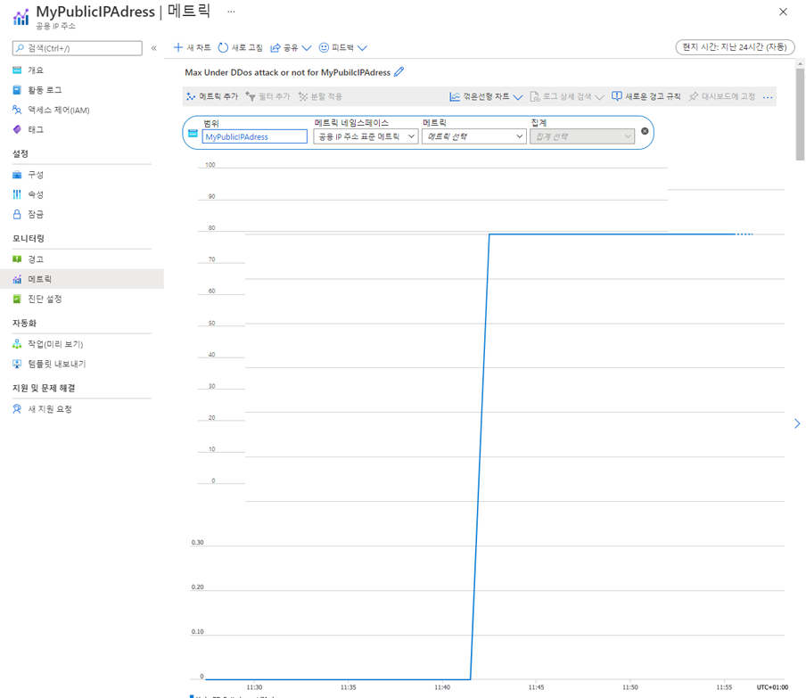

 
