---
Exercise:
    title: 'M06-단원 7 Azure Portal을 사용하여 Azure Firewall 배포 및 구성'
    module: '모듈 - 네트워크 보안 설계 및 구현'
---

# M06-단원 7 Azure Portal을 사용하여 Azure Firewall 배포 및 구성

이 연습에서 여러분은 Contoso의 네트워크 보안 팀원 역할을 맡아 특정 웹 사이트 액세스를 허용/거부하는 방화벽 규칙을 만듭니다. 다음 단계에서는 환경 준비 작업으로 리소스 그룹/가상 네트워크/서브넷/가상 머신 만들기, 방화벽 및 방화벽 정책 배포, 기본 경로/애플리케이션/네트워크/DNAT 규칙 구성, 방화벽 테스트 과정을 안내합니다.

이 연습에서는 다음을 수행합니다.

+ 작업 1: 리소스 그룹 만들기
+ 작업 2: 가상 네트워크 및 서브넷 만들기
+ 작업 3: 가상 머신 만들기
+ 작업 4: 방화벽 및 방화벽 정책 배포
+ 작업 5: 기본 경로 만들기
+ 작업 6: 애플리케이션 규칙 구성
+ 작업 7: 네트워크 규칙 구성
+ 작업 8: DNAT(대상 NAT) 규칙 구성
+ 작업 9: 서버 네트워크 인터페이스의 기본 및 보조 DNS 주소 변경
+ 작업 10: 방화벽 테스트

## 작업 1: 리소스 그룹 만들기

이 작업에서는 새 리소스 그룹을 만듭니다.

1. Azure 계정에 로그인

2. Azure Portal 홈 페이지에서 **리소스 그룹**을 선택합니다.

3. **만들기**를 클릭합니다. 

4. **기본 사항** 탭의 **리소스 그룹**에 **Test-FW-RG**를 입력합니다.

5. **지역**의 목록에서 사용자의 지역을 선택합니다.

   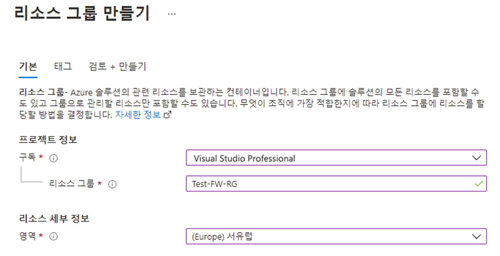

6. **검토 + 만들기**를 클릭합니다.

7. **만들기**를 클릭합니다.

 

## 작업 2: 가상 네트워크 및 서브넷 만들기

이 작업에서는 서브넷 2개가 포함된 가상 네트워크 하나를 만듭니다.

1. Azure Portal 홈 페이지에서 **리소스 만들기**를 선택하고 검색 상자에 **가상 네트워크**를 입력한 후 **가상 네트워크**가 표시되면 선택합니다.

2. **만들기**를 클릭합니다.

3. 앞에서 만든 **Test-FW-RG** 리소스 그룹을 선택합니다.

4. **이름** 상자에 **Test-FW-VN**을 입력합니다.

   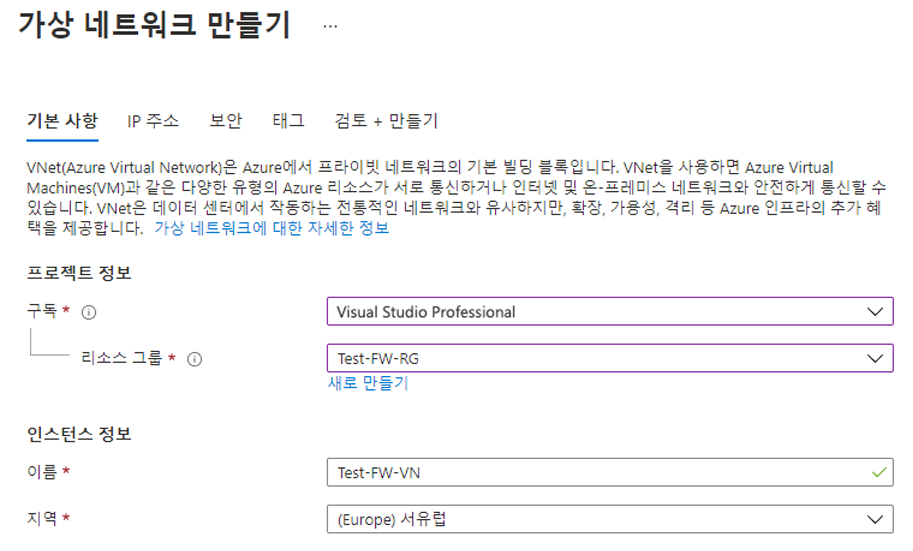

5. **다음: IP 주소**를 클릭합니다. IPv4 주소 공간 10.0.0.0/16이 기본적으로 제공되지 않은 경우 입력합니다. 

6. **서브넷 이름** 아래에서 **기본값**이라는 단어를 클릭합니다.

7. **서브넷 편집** 대화 상자에서 이름을 **AzureFirewallSubnet**으로 변경합니다.

8. **서브넷 주소 범위**를 **10.0.1.0/26**으로 변경합니다.

9. **저장**을 클릭합니다.

   

10. **서브넷 추가**를 클릭하여 다른 서브넷을 만듭니다. 이 서브넷은 잠시 후에 만들 워크로드 서버를 호스트합니다.

11. **서브넷 편집** 대화 상자에서 이름을 **Workload-SN**으로 변경합니다.

12. **서브넷 주소 범위**를 **10.0.2.0/24**로 변경합니다.

13. **추가**를 클릭합니다.

    

14. **검토 + 만들기**를 클릭합니다.

15. **만들기**를 클릭합니다.

 

## 작업 3: 가상 머신 만들기

이 작업에서는 워크로드 가상 머신을 만들어 앞에서 만든 Workload-SN 서브넷에 배치합니다.

1. Azure Portal 홈 페이지에서 **리소스 만들기**를 선택하고 검색 상자에 **가상 머신**을 입력한 후 **가상 머신**이 표시되면 선택합니다.

2. **가상 머신** 페이지에서 **만들기**를 클릭합니다.

3. **기본 사항** 탭에서 다음 표의 정보를 사용하여 새 VM을 만듭니다.

   | **설정**          | **값**                                                    |
   | -------------------- | ------------------------------------------------------------ |
   | 구독         | 보유한 구독 선택                                     |
   | 리소스 그룹       | **Test-FW-RG**                                               |
   | 가상 머신 이름 | **Srv-Work**                                                 |
   | 지역               | 사용자의 지역                                                  |
   | 가용성 옵션 | **인프라 중복이 필요하지 않습니다.**                    |
   | 이미지                | **Windows Server 2016 Datacenter - Gen 1**                   |
   | 크기                 | **모든 크기 보기**를 선택하고 목록에서 **B1s**를 선택한 다음 **선택**  **(Standard_B1s - vCPU 1개, 1GiB 메모리(£8.60/month)를 선택합니다.** |
   | 사용자 이름             | **MyAdmin**                                                  |
   | 암호             | **TestPa$$w0rd!**                                            |
   | 암호 확인     | **TestPa$$w0rd!**                                            |
   | 공용 인바운드 포트 | **없음**을 선택합니다.                                              |

   

4. **다음: 디스크**를 클릭합니다.

5. **다음: 네트워킹**을 클릭합니다.

6. 가상 네트워크로 **Test-FW-VN**이 선택되어 있으며 서브넷이 **Workload-SN**인지 확인합니다.

7. **공용 IP**에서는 **없음**을 선택합니다.

8. **다음: 관리**를 클릭합니다.

9. **모니터링**에서 **부팅 진단**을 **사용 안 함**으로 설정합니다.

10. **검토 + 만들기**를 클릭합니다.

11. **만들기**를 클릭합니다.

12. VM 배포가 완료되면 **리소스로 이동**을 클릭합니다.

13. **Srv-Work**의 **개요** 페이지 오른쪽 **네트워킹** 아래에 표시되어 있는 이 VM의 **개인 IP 주소**(예: **10.0.2.4**)를 적어 둡니다.

 

## 작업 4: 방화벽 및 방화벽 정책 배포

이 작업에서는 방화벽 정책이 구성된 방화벽을 가상 네트워크에 배포합니다.

1. Azure Portal 홈 페이지에서 **리소스 만들기**를 선택하고 검색 상자에 **방화벽**을 입력한 후 **방화벽**이 표시되면 선택합니다.

2. **방화벽** 페이지에서 **만들기**를 클릭합니다.

3. **기본 사항** 탭에서 다음 표의 정보를 사용하여 방화벽을 만듭니다.

   | **설정**          | **값**                                                    |
   | -------------------- | ------------------------------------------------------------ |
   | 구독         | 보유한 구독 선택                                     |
   | 리소스 그룹       | **Test-FW-RG**                                               |
   | 가상 머신 이름 | **테스트 FW01**                                                |
   | 지역               | 사용자의 지역                                                  |
   | 방화벽 계층        | **표준**                                                 |
   | 방화벽 관리  | **방화벽 정책을 사용하여 이 방화벽 관리**            |
   | 방화벽 정책      | **새로 추가**를 선택합니다. 이름: **fw-test-pol** 지역: **사용자의 지역** |

   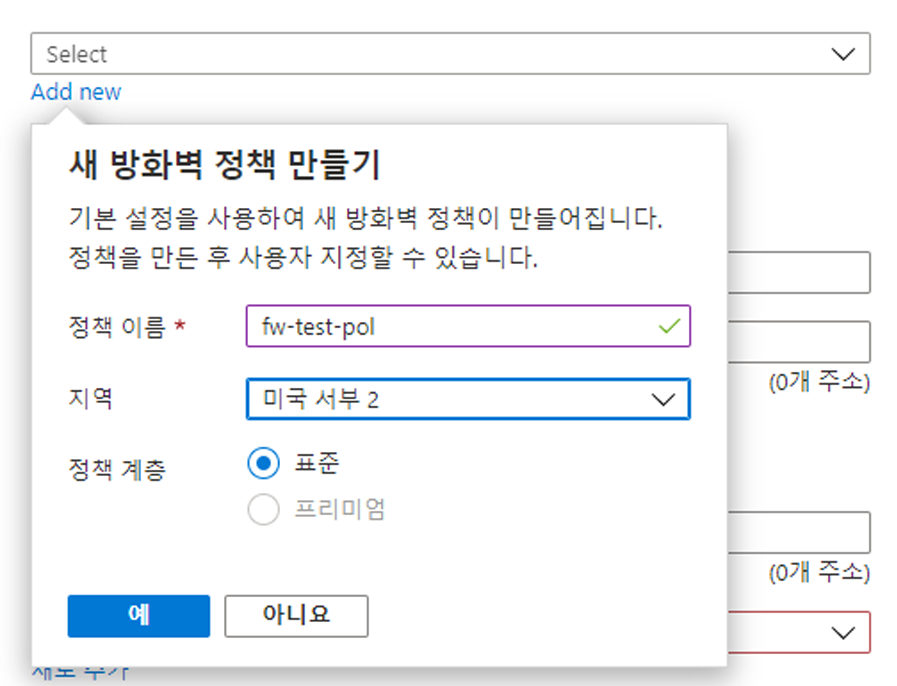

   | 가상 네트워크 선택 | **기존 항목 사용**                         |
   | ------------------------ | ---------------------------------------- |
   | 가상 네트워크          | **Test-FW-VN**                           |
   | 공용 IP 주소        | **새로 추가**를 선택합니다. 이름: **fw-pip** |

   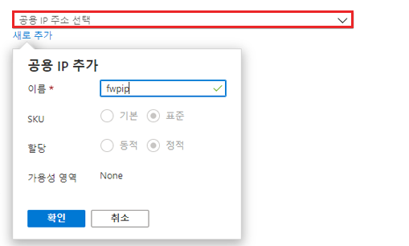

4. 모든 설정을 검토하여 아래 스크린샷과 일치하는지 확인합니다.

   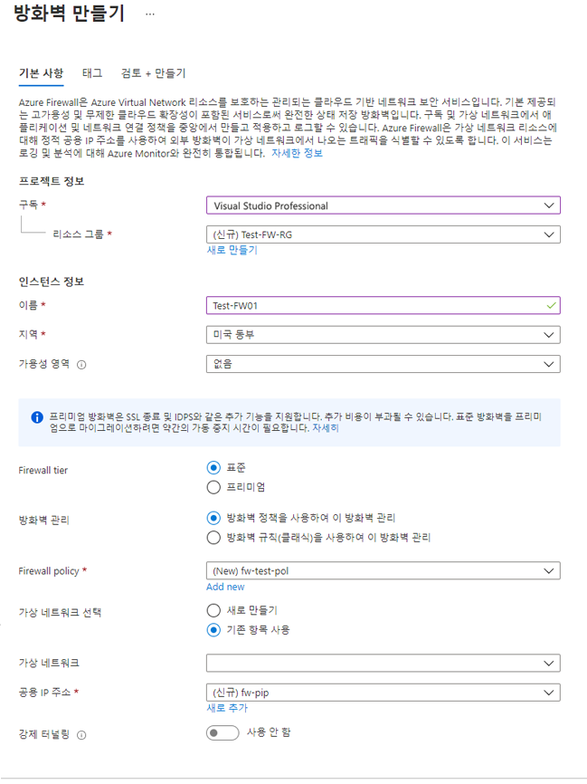

5. **검토 + 만들기**를 클릭합니다.

6. **만들기**를 클릭하고 방화벽 배포가 완료될 때까지 기다립니다.

7. 방화벽 배포가 완료되면 **리소스로 이동**을 클릭합니다.

8. **Test-FW01**의 **개요** 페이지 오른쪽에 표시되어 있는 이 방화벽의 **방화벽 프라이빗 IP**(예: **10.0.1.4**)를 적어 둡니다.

9. 왼쪽 메뉴의 **설정** 아래에서 **공용 IP 구성**을 클릭합니다.

10. **fw-pip** 공용 IP 구성에서 **IP 주소** 아래의 주소(예: **20.90.136.51**)를 적어 둡니다.

 

## 작업 5: 기본 경로 만들기

이 작업에서는 Workload-SN 서브넷에서 방화벽을 통과하도록 아웃바운드 기본 경로를 구성합니다.

1. Azure Portal 홈 페이지에서 **리소스 만들기**를 선택하고 검색 상자에 **경로**를 입력한 후 **경로 테이블**이 표시되면 선택합니다.

2. **경로 테이블** 페이지에서 **만들기**를 클릭합니다.

3. **기본 사항** 탭에서 다음 표의 정보를 사용하여 새 경로 테이블을 만듭니다.

   | **설정**              | **값**                |
   | ------------------------ | ------------------------ |
   | 구독             | 보유한 구독 선택 |
   | 리소스 그룹           | **Test-FW-RG**           |
   | 지역                   | 사용자의 지역              |
   | 이름                     | **Firewall-route**       |
   | 게이트웨이 경로 전파 | **예**                  |

4. **검토 + 만들기**를 클릭합니다.

5. **만들기**를 클릭합니다.

   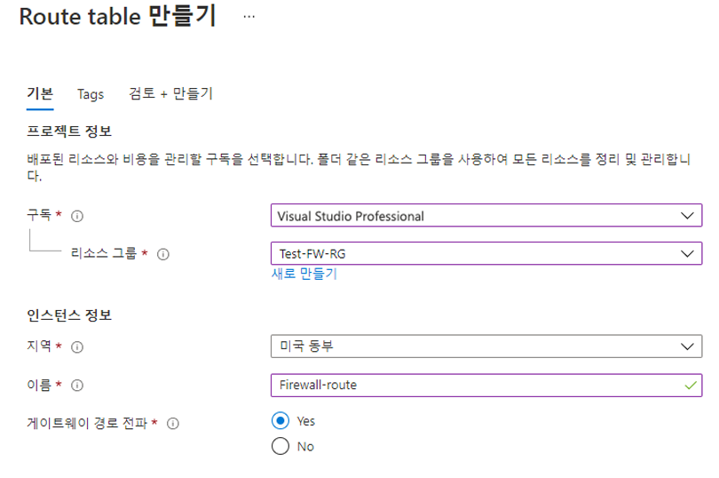

6. 배포가 완료되면 **리소스로 이동**을 선택합니다.

7. **Firewall-route** 페이지의 **설정** 아래에서 **서브넷**을 클릭하고 **연결**을 클릭합니다.

8. **가상 네트워크**에서 **Test-FW-VN**을 선택합니다.

9. **서브넷**에서 **Workload-SN**을 선택합니다. 이 경로용으로 Workload-SN 서브넷만 선택해야 합니다. 다른 서브넷도 선택하면 방화벽이 제대로 작동하지 않습니다.

10. **확인**을 클릭합니다.

11. **설정** 아래에서 **경로**를 선택하고 **추가**를 클릭합니다.

12. **경로 이름**에 **fw-dg**를 입력합니다.

13. **주소 접두사**에 **0.0.0.0/0**을 입력합니다.

14. **다음 홉 형식**에서 **가상 어플라이언스**를 선택합니다.

15. **다음 홉 주소**에 앞에서 적어 둔 방화벽용 개인 IP 주소(예: **10.0.1.4**)를 입력합니다.

16. **확인**을 클릭합니다.

    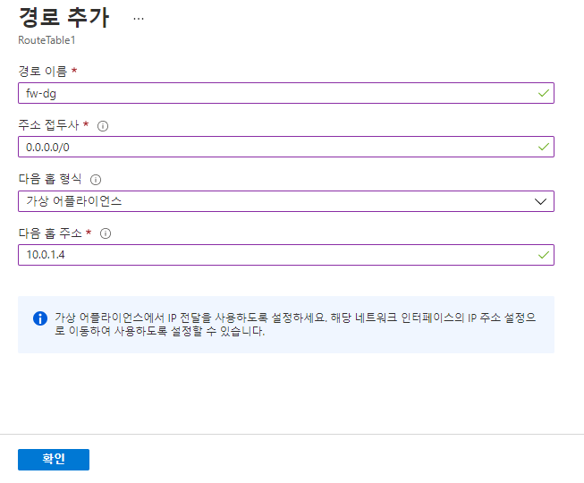

 

## 작업 6: 애플리케이션 규칙 구성

이 작업에서는 www.google.com에 대한 아웃바운드 액세스를 허용하는 애플리케이션 규칙을 추가합니다.

1. Azure Portal 홈 페이지에서 **모든 리소스**를 선택합니다.

2. 리소스 목록에서 방화벽 정책 **fw-test-pol**을 클릭합니다.

3. **설정** 아래에서 **애플리케이션 구칙**을 클릭합니다.

4. **규칙 컬렉션 추가**를 클릭합니다.

5. **규칙 컬렉션 추가** 페이지에서 다음 표의 정보를 사용하여 새 애플리케이션 규칙을 만듭니다.

   | **설정**            | **값**                                 |
   | ---------------------- | ----------------------------------------- |
   | 이름                   | **App-Coll01**                            |
   | 규칙 컬렉션 형식   | **애플리케이션**                           |
   | 우선 순위               | **200**                                   |
   | 규칙 컬렉션 작업 | **허용**                                 |
   | 규칙 컬렉션 그룹  | **DefaultApplicationRuleCollectionGroup** |
   | **규칙 섹션**      |                                           |
   | 이름                   | **Allow-Google**                          |
   | 원본 유형            | **IP 주소**                            |
   | 원본                 | **10.0.2.0/24**                           |
   | 프로토콜               | **http,https**                            |
   | 대상 유형       | **FQDN**                                  |
   | 대상            | **www.google.com**                        |

   

6. **추가**를 클릭합니다.

 

## 작업 7: 네트워크 규칙 구성

이 작업에서는 포트 53(DNS)에서 IP 주소 2개에 대한 아웃바운드 액세스를 허용하는 네트워크 규칙을 추가합니다.

1. **fw-test-pol** 페이지의 **설정** 아래에서 **네트워크 규칙**을 클릭합니다.

2. **규칙 컬렉션 추가**를 클릭합니다.

3. **규칙 컬렉션 추가** 페이지에서 다음 표의 정보를 사용하여 새 네트워크 규칙을 만듭니다.

   | **설정**            | **값**                                                    |
   | ---------------------- | ------------------------------------------------------------ |
   | 이름                   | **Net-Coll01**                                               |
   | 규칙 컬렉션 형식   | **네트워크**                                                  |
   | 우선 순위               | **200**                                                      |
   | 규칙 컬렉션 작업 | **허용**                                                    |
   | 규칙 컬렉션 그룹  | **DefaultNetworkRuleCollectionGroup**                        |
   | **규칙 섹션**      |                                                              |
   | 이름                   | **허용-DNS**                                                |
   | 원본 유형            | **IP 주소**                                               |
   | 원본                 | **10.0.2.0/24**                                              |
   | 프로토콜               | **UDP**                                                      |
   | 대상 포트      | **53**                                                       |
   | 대상 유형       | **IP 주소**                                               |
   | 대상            | **209.244.0.3, 209.244.0.4** 이 주소는 Century Link에서 운영하는 공용 DNS 서버의 주소입니다. |

   ​	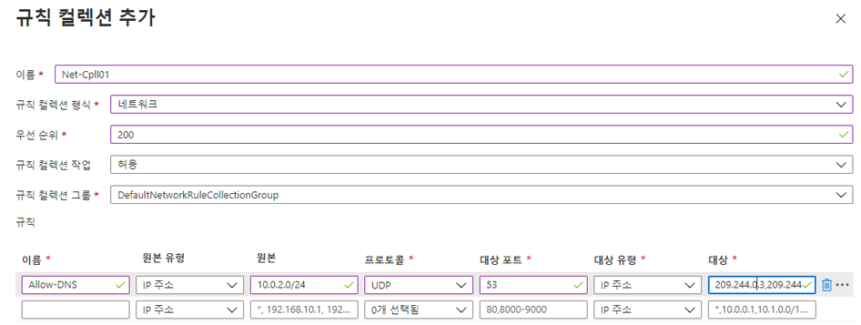

4. **추가**를 클릭합니다.

 

## 작업 8: DNAT(대상 NAT) 규칙 구성

이 작업에서는 방화벽을 통해 원격 데스크톱을 Srv-Work 가상 머신에 연결하도록 허용하는 DNAT 규칙을 추가합니다.

1. **fw-test-pol** 페이지의 **설정**아래에서 **DNAT 규칙**을 클릭합니다.

2. **규칙 컬렉션 추가**를 클릭합니다.

3. **규칙 컬렉션 추가** 페이지에서 다음 표의 정보를 사용하여 새 DNAT 규칙을 만듭니다.

   | **설정**           | **값**                                                    |
   | --------------------- | ------------------------------------------------------------ |
   | 이름                  | **rdp**                                                      |
   | 규칙 컬렉션 형식  | **DNAT**                                                     |
   | 우선 순위              | **200**                                                      |
   | 규칙 컬렉션 그룹 | **DefaultDnatRuleCollectionGroup**                           |
   | **규칙 섹션**     |                                                              |
   | 이름                  | **rdp-nat**                                                  |
   | 원본 유형           | **IP 주소**                                               |
   | 원본                | *                                                         |
   | 프로토콜              | **TCP**                                                      |
   | 대상 포트     | **3389**                                                     |
   | 대상 유형      | **IP 주소**                                               |
   | 대상           | 앞에서 적어 둔 **fw-pip**의 방화벽 공용 IP 주소를 입력합니다. **예: - 20.90.136.51** |
   | 번역된 주소    | 앞에서 적어 둔 **Srv-Work**의 프라이빗용 IP 주소를 입력합니다. **예: - 10.0.2.4** |
   | 번역된 포트       | **3389**                                                     |

​		

4. **추가**를 클릭합니다.

 

## 작업 9: 서버 네트워크 인터페이스의 기본 및 보조 DNS 주소 변경

이 작업에서는 이 연습에서 진행할 테스트를 위해 Srv-Work 서버의 기본 및 보조 DNS 주소를 구성합니다. 하지만 이 작업이 일반적인 Azure Firewall 요구 사항인 것은 아닙니다.

1. Azure Portal 홈 페이지에서 **리소스 그룹**을 선택합니다.

2. 리소스 그룹 목록에서 앞에서 만든 리소스 그룹 **Test-FW-RG**를 클릭합니다.

3. 이 리소스 그룹의 리소스 목록에서 **Srv-Work** 가상 머신의 네트워크 인터페이스(예: **srv-work350**)를 선택합니다.

   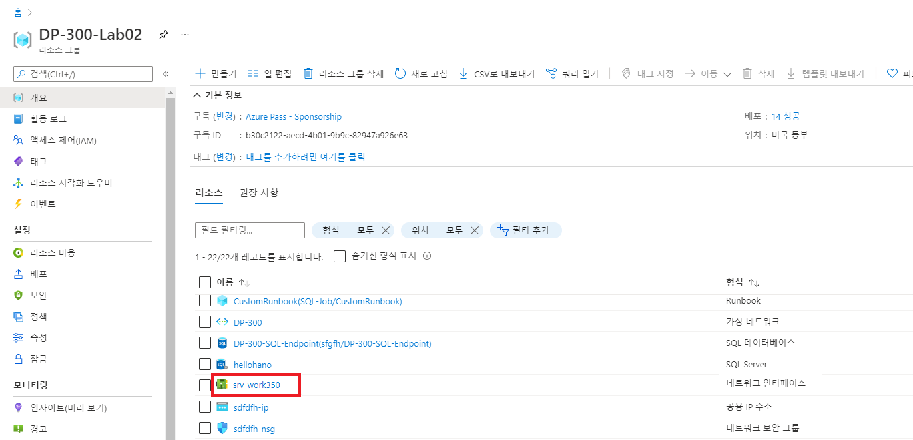

4. **설정**에서 **DNS 서버**를 선택합니다.

5. **DNS 서버**에서 **사용자 지정**을 선택합니다.

6. **DNS 서버 추가** 텍스트 상자에는 **209.244.0.3**을 입력하고 다음 텍스트 상자에는 **209.244.0.4**을 입력합니다.

7. **저장**을 선택합니다.

   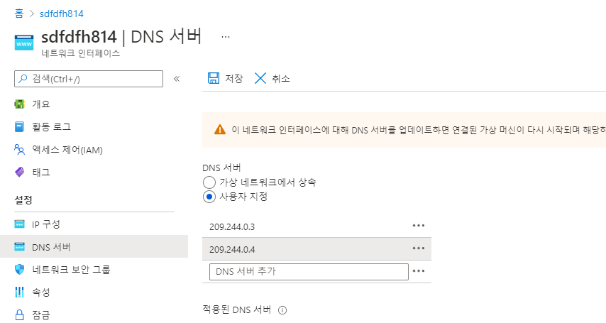

8. **Srv-Work** 가상 머신을 다시 시작합니다.

 

## 작업 10: 방화벽 테스트

이 작업에서는 방화벽을 테스트하여 규칙이 올바르게 구성되었으며 정상적으로 작동하는지를 확인합니다. 이 구성을 사용하면 방화벽을 통해 방화벽 공용 IP 주소를 사용하여 원격 데스크톱을 Srv-Work 가상 머신에 연결할 수 있습니다.

1. PC에서 **원격 데스크톱 연결**을 엽니다.

2. **컴퓨터** 상자에 방화벽의 공용 IP 주소(예: **20.90.136.51:3389**와 같이 **20.90.136.51** 뒤에 **3389**가 붙은 형식)를 입력합니다.

3. **사용자 이름** 상자에 **MyAdmin**을 입력합니다.

4. **연결**을 클릭합니다.

   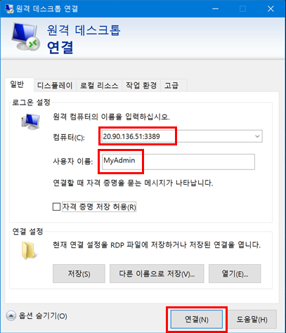

5. **자격 증명 입력** 대화 상자에서 암호로 **TestPa$$w0rd!** 를 사용하여 **Srv-Work** 서버 가상 머신에 로그인합니다.

6. **확인**을 클릭합니다.

7. 인증서 메시지에서 **예**를 클릭합니다.

8. Internet Explorer를 열고 **https://www.google.com** 으로 이동합니다.

9. **보안 경고** 대화 상자에서 **확인**을 클릭합니다.

10. Internet Explorer 보안 경고 팝업이 표시될 수 있습니다. 그러면 **닫기**를 클릭합니다.

11. Google 홈 페이지가 표시됩니다.

    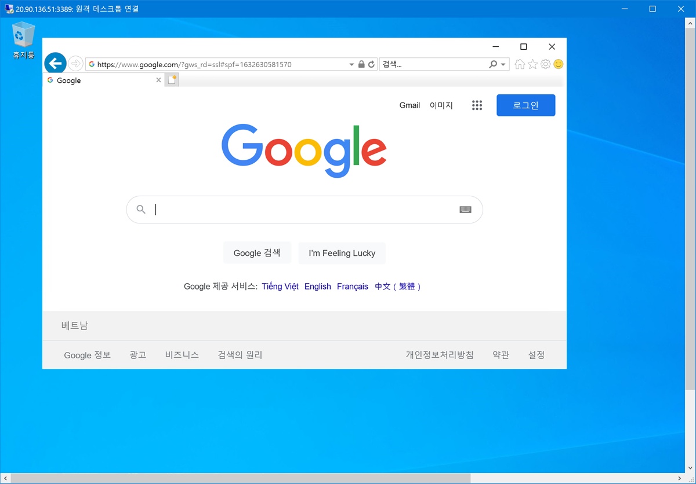

12. **https://www.microsoft.com** 으로 이동합니다.

13. 페이지 액세스가 방화벽에 의해 차단됩니다.

    

 
